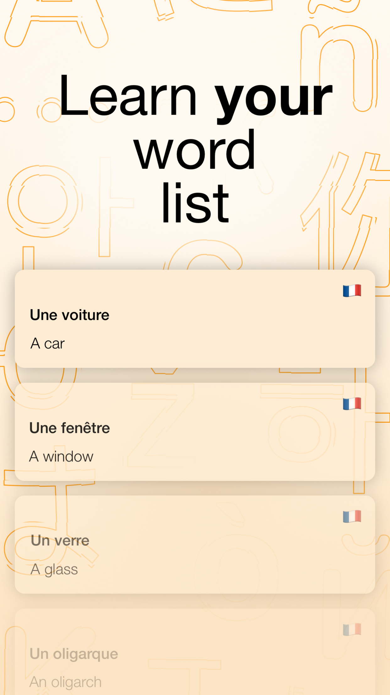
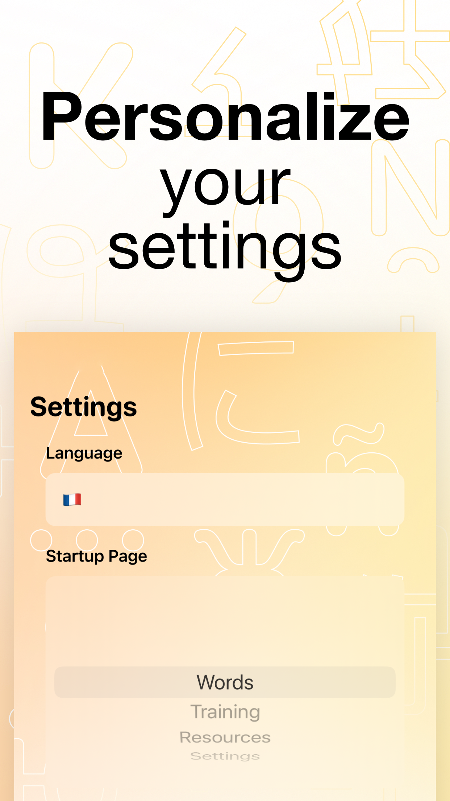
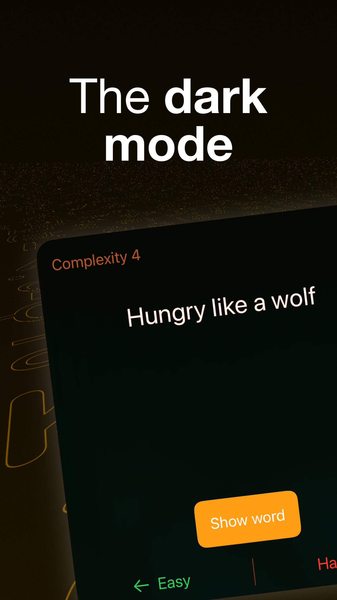

# LexiSwipe

Cartes De Mots is a mobile application for learning foreign words, developed using SwiftUI.

## Description

This app helps users learn new words in a foreign language using a flashcard system. Users can add new words and practice remembering them. The app is localized into three languages and uses iCloud to save data. 

## Features

- Add new words with translations and comments
- Flashcard-based learning system
- Save useful links
- Customize learning language
- Intuitive user interface

## Technologies Used

- SwiftUI
- SwiftData for data persistence
- Pow for animations

## Screenshots

  
   
  
  

## Installation

OR
1. Clone the repository
2. Open the project in Xcode
3. Run the app on a simulator or a real device

## Future Improvements

I'm open to ideas for integrating new features into the application. If you have any suggestions or want to contribute to the project, please create an issue or submit a pull request.

## License

All rights reserved. Unauthorized copying, modification, distribution, or use of the code in this project is strictly prohibited without prior written permission from the author.

## Contact

If you have any questions or suggestions, please contact me through GitHub.
