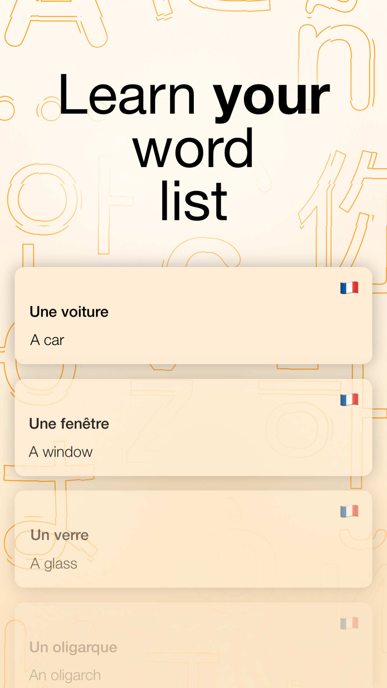
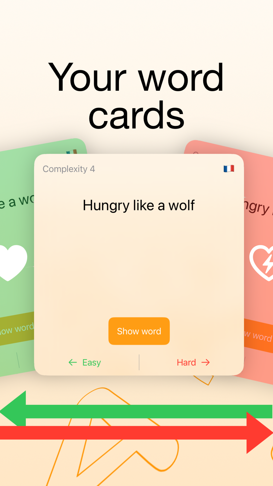
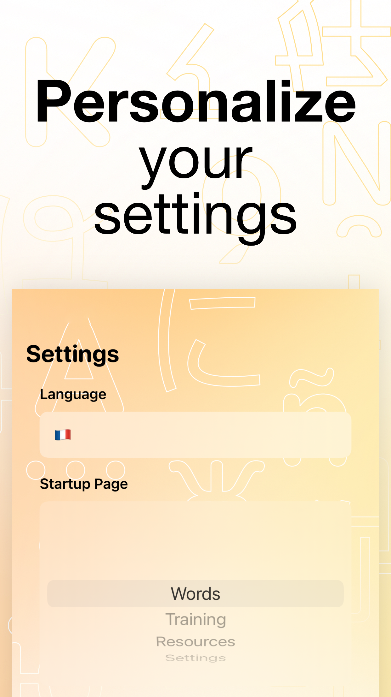

This file is a merged representation of the entire codebase, combined into a single document by Repomix.

# File Summary

## Purpose
This file contains a packed representation of the entire repository's contents.
It is designed to be easily consumable by AI systems for analysis, code review,
or other automated processes.

## File Format
The content is organized as follows:
1. This summary section
2. Repository information
3. Directory structure
4. Repository files (if enabled)
4. Multiple file entries, each consisting of:
  a. A header with the file path (## File: path/to/file)
  b. The full contents of the file in a code block

## Usage Guidelines
- This file should be treated as read-only. Any changes should be made to the
  original repository files, not this packed version.
- When processing this file, use the file path to distinguish
  between different files in the repository.
- Be aware that this file may contain sensitive information. Handle it with
  the same level of security as you would the original repository.

## Notes
- Some files may have been excluded based on .gitignore rules and Repomix's configuration
- Binary files are not included in this packed representation. Please refer to the Repository Structure section for a complete list of file paths, including binary files
- Files matching patterns in .gitignore are excluded
- Files matching default ignore patterns are excluded
- Files are sorted by Git change count (files with more changes are at the bottom)

## Additional Info

# Directory Structure
```
CartesDeMots/
  Assets.xcassets/
    AccentColor.colorset/
      Contents.json
    AppIcon.appiconset/
      Contents.json
    bgAdd.imageset/
      Contents.json
    bgLanguages.imageset/
      Contents.json
    bgLearn.imageset/
      Contents.json
    bgList.imageset/
      Contents.json
    bgListInverse.imageset/
      Contents.json
    bgResources.imageset/
      Contents.json
    bgSettings.imageset/
      Contents.json
    Contents.json
  en.lproj/
    Localizable.strings
  fr.lproj/
    Localizable.strings
  Model/
    Card.swift
    ModalHandler.swift
    Resource.swift
    Settings.swift
    Tab.swift
  Preview Content/
    Preview Assets.xcassets/
      Contents.json
  ru.lproj/
    Localizable.strings
  Utilities/
    HapticManager.swift
  View/
    CardItemView.swift
    CardsView.swift
    ContentView.swift
    FlagPickerView.swift
    GlassTextFieldView.swift
    GlassView.swift
    LearnView.swift
    LongPressButtonView.swift
    MainTabView.swift
    NewLinkView.swift
    NewWordView.swift
    ResourceItemView.swift
    ResourcesView.swift
    SettingsView.swift
    TabBarItemView.swift
  ViewModel/
    CardsViewModel.swift
    LearnViewModel.swift
    ResourcesViewModel.swift
  CartesDeMots.entitlements
  CartesDeMotsApp.swift
  CartesDeMotsRelease.entitlements
  Info.plist
CartesDeMots.xcodeproj/
  project.xcworkspace/
    xcshareddata/
      swiftpm/
        Package.resolved
      IDEWorkspaceChecks.plist
    contents.xcworkspacedata
  xcshareddata/
    xcschemes/
      CartesDeMots.xcscheme
  xcuserdata/
    timlapov.xcuserdatad/
      xcdebugger/
        Breakpoints_v2.xcbkptlist
      xcschemes/
        xcschememanagement.plist
  project.pbxproj
README.md
```

# Files

## File: CartesDeMots/Assets.xcassets/AccentColor.colorset/Contents.json
```json
{
  "colors" : [
    {
      "idiom" : "universal"
    }
  ],
  "info" : {
    "author" : "xcode",
    "version" : 1
  }
}
```

## File: CartesDeMots/Assets.xcassets/bgLanguages.imageset/Contents.json
```json
{
  "images" : [
    {
      "filename" : "photo-1571498664957-fde285d79857.jpeg",
      "idiom" : "universal",
      "scale" : "1x"
    },
    {
      "idiom" : "universal",
      "scale" : "2x"
    },
    {
      "idiom" : "universal",
      "scale" : "3x"
    }
  ],
  "info" : {
    "author" : "xcode",
    "version" : 1
  }
}
```

## File: CartesDeMots/Assets.xcassets/Contents.json
```json
{
  "info" : {
    "author" : "xcode",
    "version" : 1
  }
}
```

## File: CartesDeMots/Model/ModalHandler.swift
```swift
//
//  ModalHandler.swift
//  CartesDeMots
//
//  Created by Timothée LAPOV on 08/05/2024.
//

import Foundation

struct ModalHandler: Identifiable {
    var id: String = UUID().uuidString
}
```

## File: CartesDeMots/Preview Content/Preview Assets.xcassets/Contents.json
```json
{
  "info" : {
    "author" : "xcode",
    "version" : 1
  }
}
```

## File: CartesDeMots/View/FlagPickerView.swift
```swift
//
//  FlagPickerView.swift
//  CartesDeMots
//
//  Created by Timothée LAPOV on 08/05/2024.
//

import Foundation
import SwiftUI

struct FlagPickerView: View {
    let flags = ["🇬🇧", "🇪🇸", "🇫🇷", "🇩🇪", "🇵🇹", "🏳️", "🇷🇺", "🇨🇳", "🇸🇦", "🇯🇵", "🇮🇳"]
    @State private var selectedFlag = "🏳️"

    var body: some View {
        VStack {
            Picker("Choose your flag", selection: $selectedFlag) {
                ForEach(flags, id: \.self) { flag in
                    Text(flag).tag(flag)
                }
            }
            .pickerStyle(.palette)
            .padding()
        }
    }
}

#Preview {
    FlagPickerView()
}
```

## File: CartesDeMots/ViewModel/CardsViewModel.swift
```swift
//
//  CardsViewModel.swift
//  CartesDeMots
//
//  Created by Timothée LAPOV on 08/05/2024.
//

import Foundation


class CardsViewModel: ObservableObject {
    @Published var addViewHandler: ModalHandler?
}
```

## File: CartesDeMots/ViewModel/ResourcesViewModel.swift
```swift
//
//  ResourcesViewModel.swift
//  CartesDeMots
//
//  Created by Timothée LAPOV on 08/05/2024.
//

import Foundation

class ResourcesViewModel: ObservableObject {
    @Published var addViewHandler: ModalHandler?
}
```

## File: CartesDeMots/Info.plist
```
<?xml version="1.0" encoding="UTF-8"?>
<!DOCTYPE plist PUBLIC "-//Apple//DTD PLIST 1.0//EN" "http://www.apple.com/DTDs/PropertyList-1.0.dtd">
<plist version="1.0">
<dict>
	<key>UIBackgroundModes</key>
	<array>
		<string>remote-notification</string>
	</array>
</dict>
</plist>
```

## File: CartesDeMots.xcodeproj/project.xcworkspace/xcshareddata/swiftpm/Package.resolved
```
{
  "originHash" : "ad2571106299969bc8c78dbd19c0d3b3e70730d6d17777fc50f70323a5c3d845",
  "pins" : [
    {
      "identity" : "pow",
      "kind" : "remoteSourceControl",
      "location" : "https://github.com/EmergeTools/Pow",
      "state" : {
        "revision" : "f0d0f3e72d42beaf2b01f1cb798e1b55902814eb",
        "version" : "1.0.4"
      }
    }
  ],
  "version" : 3
}
```

## File: CartesDeMots.xcodeproj/project.xcworkspace/xcshareddata/IDEWorkspaceChecks.plist
```
<?xml version="1.0" encoding="UTF-8"?>
<!DOCTYPE plist PUBLIC "-//Apple//DTD PLIST 1.0//EN" "http://www.apple.com/DTDs/PropertyList-1.0.dtd">
<plist version="1.0">
<dict>
	<key>IDEDidComputeMac32BitWarning</key>
	<true/>
</dict>
</plist>
```

## File: CartesDeMots.xcodeproj/project.xcworkspace/contents.xcworkspacedata
```
<?xml version="1.0" encoding="UTF-8"?>
<Workspace
   version = "1.0">
   <FileRef
      location = "self:">
   </FileRef>
</Workspace>
```

## File: CartesDeMots/Assets.xcassets/AppIcon.appiconset/Contents.json
```json
{
  "images" : [
    {
      "filename" : "icon.jpeg",
      "idiom" : "universal",
      "platform" : "ios",
      "size" : "1024x1024"
    }
  ],
  "info" : {
    "author" : "xcode",
    "version" : 1
  }
}
```

## File: CartesDeMots/Assets.xcassets/bgAdd.imageset/Contents.json
```json
{
  "images" : [
    {
      "filename" : "4.jpg",
      "idiom" : "universal",
      "scale" : "1x"
    },
    {
      "appearances" : [
        {
          "appearance" : "luminosity",
          "value" : "dark"
        }
      ],
      "filename" : "l1.jpg",
      "idiom" : "universal",
      "scale" : "1x"
    },
    {
      "idiom" : "universal",
      "scale" : "2x"
    },
    {
      "appearances" : [
        {
          "appearance" : "luminosity",
          "value" : "dark"
        }
      ],
      "idiom" : "universal",
      "scale" : "2x"
    },
    {
      "idiom" : "universal",
      "scale" : "3x"
    },
    {
      "appearances" : [
        {
          "appearance" : "luminosity",
          "value" : "dark"
        }
      ],
      "idiom" : "universal",
      "scale" : "3x"
    }
  ],
  "info" : {
    "author" : "xcode",
    "version" : 1
  }
}
```

## File: CartesDeMots/Assets.xcassets/bgLearn.imageset/Contents.json
```json
{
  "images" : [
    {
      "filename" : "3 (1).jpg",
      "idiom" : "universal",
      "scale" : "1x"
    },
    {
      "appearances" : [
        {
          "appearance" : "luminosity",
          "value" : "dark"
        }
      ],
      "filename" : "n4.jpg",
      "idiom" : "universal",
      "scale" : "1x"
    },
    {
      "idiom" : "universal",
      "scale" : "2x"
    },
    {
      "appearances" : [
        {
          "appearance" : "luminosity",
          "value" : "dark"
        }
      ],
      "idiom" : "universal",
      "scale" : "2x"
    },
    {
      "idiom" : "universal",
      "scale" : "3x"
    },
    {
      "appearances" : [
        {
          "appearance" : "luminosity",
          "value" : "dark"
        }
      ],
      "idiom" : "universal",
      "scale" : "3x"
    }
  ],
  "info" : {
    "author" : "xcode",
    "version" : 1
  }
}
```

## File: CartesDeMots/Assets.xcassets/bgList.imageset/Contents.json
```json
{
  "images" : [
    {
      "filename" : "1 (2).jpg",
      "idiom" : "universal",
      "scale" : "1x"
    },
    {
      "appearances" : [
        {
          "appearance" : "luminosity",
          "value" : "dark"
        }
      ],
      "filename" : "n1.jpg",
      "idiom" : "universal",
      "scale" : "1x"
    },
    {
      "idiom" : "universal",
      "scale" : "2x"
    },
    {
      "appearances" : [
        {
          "appearance" : "luminosity",
          "value" : "dark"
        }
      ],
      "idiom" : "universal",
      "scale" : "2x"
    },
    {
      "idiom" : "universal",
      "scale" : "3x"
    },
    {
      "appearances" : [
        {
          "appearance" : "luminosity",
          "value" : "dark"
        }
      ],
      "idiom" : "universal",
      "scale" : "3x"
    }
  ],
  "info" : {
    "author" : "xcode",
    "version" : 1
  }
}
```

## File: CartesDeMots/Assets.xcassets/bgListInverse.imageset/Contents.json
```json
{
  "images" : [
    {
      "filename" : "4421 (1).jpg",
      "idiom" : "universal",
      "scale" : "1x"
    },
    {
      "appearances" : [
        {
          "appearance" : "luminosity",
          "value" : "dark"
        }
      ],
      "filename" : "n3.jpg",
      "idiom" : "universal",
      "scale" : "1x"
    },
    {
      "idiom" : "universal",
      "scale" : "2x"
    },
    {
      "appearances" : [
        {
          "appearance" : "luminosity",
          "value" : "dark"
        }
      ],
      "idiom" : "universal",
      "scale" : "2x"
    },
    {
      "idiom" : "universal",
      "scale" : "3x"
    },
    {
      "appearances" : [
        {
          "appearance" : "luminosity",
          "value" : "dark"
        }
      ],
      "idiom" : "universal",
      "scale" : "3x"
    }
  ],
  "info" : {
    "author" : "xcode",
    "version" : 1
  }
}
```

## File: CartesDeMots/Assets.xcassets/bgResources.imageset/Contents.json
```json
{
  "images" : [
    {
      "filename" : "5.jpg",
      "idiom" : "universal",
      "scale" : "1x"
    },
    {
      "appearances" : [
        {
          "appearance" : "luminosity",
          "value" : "dark"
        }
      ],
      "filename" : "n2.jpg",
      "idiom" : "universal",
      "scale" : "1x"
    },
    {
      "idiom" : "universal",
      "scale" : "2x"
    },
    {
      "appearances" : [
        {
          "appearance" : "luminosity",
          "value" : "dark"
        }
      ],
      "idiom" : "universal",
      "scale" : "2x"
    },
    {
      "idiom" : "universal",
      "scale" : "3x"
    },
    {
      "appearances" : [
        {
          "appearance" : "luminosity",
          "value" : "dark"
        }
      ],
      "idiom" : "universal",
      "scale" : "3x"
    }
  ],
  "info" : {
    "author" : "xcode",
    "version" : 1
  }
}
```

## File: CartesDeMots/Assets.xcassets/bgSettings.imageset/Contents.json
```json
{
  "images" : [
    {
      "filename" : "4421.jpg",
      "idiom" : "universal",
      "scale" : "1x"
    },
    {
      "appearances" : [
        {
          "appearance" : "luminosity",
          "value" : "dark"
        }
      ],
      "filename" : "n3.jpg",
      "idiom" : "universal",
      "scale" : "1x"
    },
    {
      "idiom" : "universal",
      "scale" : "2x"
    },
    {
      "appearances" : [
        {
          "appearance" : "luminosity",
          "value" : "dark"
        }
      ],
      "idiom" : "universal",
      "scale" : "2x"
    },
    {
      "idiom" : "universal",
      "scale" : "3x"
    },
    {
      "appearances" : [
        {
          "appearance" : "luminosity",
          "value" : "dark"
        }
      ],
      "idiom" : "universal",
      "scale" : "3x"
    }
  ],
  "info" : {
    "author" : "xcode",
    "version" : 1
  }
}
```

## File: CartesDeMots/en.lproj/Localizable.strings
```
/* 
  Localizable.strings
  CartesDeMots

  Created by Timothée LAPOV on 07/07/2024.
  
*/

//MARK: TabBar
"tab_words" = "Words";
"tab_learn" = "Training";
"tab_resources" = "Resources";
"tab_settings" = "Settings";

//MARK: CardItemView
"Comment" = "Comment";
"Swipe to delete" = "Swipe to delete";

//MARK: CardsView
"Your list of words" = "Your list of words";

//MARK: NewWordView
"New word" = "New word";
"Foreign word" = "Foreign word (invisible side)";
"Translation" = "Translation (visible side)";
"Add the word" = "Add the word";

//MARK: LearnView
"Complexity %d" = "Complexity %d";
"Show word" = "Show word";
"Easy" = "Easy";
"Hard" = "Hard";
"No words available for learning" = "No words available for learning";

//MARK: ResourcesView
"Useful links" = "Useful links";

//MARK: NewLinkView
"New resource link" = "New resource link";
"Title" = "Title";
"Link" = "Link";
"Add the link" = "Add the link";

//MARK: SettingsView
"Settings" = "Settings";
"Language" = "Language";
"Enter language (emoji or name)" = "Enter language (emoji or name)";
"Startup Page" = "Startup Page";
"How to use the app" = "How to use the app";
"how_to_alert_text" = "Swipe to delete\nAll words sync between devices and are saved after reinstalling the app if you log in to the same iCloud account\nWords initially have the same rating, but it changes depending on whether the word is easy or difficult\nEasy words are shown less and less frequently, difficult ones - more often\nWords with zero rating are not shown";
"Got it" = "Got it";
"Write to developer" = "Write to developer";
"Feedback for CartesDeMots app (v%@)" = "Feedback for CartesDeMots app (v%@)";
"emailBody" = "Hello,\n\nI'm writing from the CartesDeMots app.\n\nI want to report a bug:\n\nI want to suggest an idea:\n\n";
```

## File: CartesDeMots/fr.lproj/Localizable.strings
```
/* 
  Localizable.strings
  CartesDeMots

  Created by Timothée LAPOV on 07/07/2024.
  
*/
//MARK: TabBar
"tab_words" = "Mots";
"tab_learn" = "Apprentissage";
"tab_resources" = "Ressources";
"tab_settings" = "Paramètres";

//MARK: CardItemView
"Comment" = "Commentaire";
"Swipe to delete" = "Glissez pour supprimer";

//MARK: CardsView
"Your list of words" = "Votre liste de mots";

//MARK: NewWordView
"New word" = "Nouveau mot";
"Foreign word" = "Mot étranger (côté invisible)";
"Translation" = "Traduction (côté visible)";
"Add the word" = "Ajouter le mot";

//MARK: LearnView
"Complexity %d" = "Complexité %d";
"Show word" = "Afficher le mot";
"Easy" = "Facile";
"Hard" = "Difficile";
"No words available for learning" = "Aucun mot disponible pour l'apprentissage";

//MARK: ResourcesView
"Useful links" = "Liens utiles";

//MARK: NewLinkView
"New resource link" = "Nouveau lien de ressource";
"Title" = "Titre";
"Link" = "Lien";
"Add the link" = "Ajouter le lien";

//MARK: SettingsView
"Settings" = "Réglages";
"Language" = "Langue";
"Enter language (emoji or name)" = "Entrez la langue (emoji ou nom)";
"Startup Page" = "Page de démarrage";
"How to use the app" = "Comment utiliser l'application";
"how_to_alert_text" = "Glissez pour supprimer\nTous les mots se synchronisent entre les appareils et sont sauvegardés après la réinstallation de l'application si vous vous connectez au même compte iCloud\nLes mots ont initialement la même note, mais elle change selon que le mot est facile ou difficile\nLes mots faciles sont montrés de moins en moins fréquemment, les difficiles - plus souvent\nLes mots dont le classement est nul ne sont pas affichés";
"Got it" = "J'ai compris";
"Write to developer" = "Écrire au développeur";
"Feedback for CartesDeMots app (v%@)" = "Commentaires sur l'application CartesDeMots (v%@)";
"emailBody" = "Bonjour,\n\nJ'écris depuis l'application CartesDeMots.\n\nJe souhaite signaler un bug :\n\nJe souhaite suggérer une idée :\n\n";
```

## File: CartesDeMots/Model/Settings.swift
```swift
//
//  Settings.swift
//  CartesDeMots
//
//  Created by Timothée LAPOV on 03/07/2024.
//
//
import Foundation
import SwiftData

@Model
final class Settings {
    var language: String?
    var mainTabRawValue: String?
    var theme: String?
    var mode: String?
    var notificationsEnabled: Bool?
    var notificationFrequency: String?
    var dailyGoal: Int?
    var stat: Double?
    
    var mainTab: Tab {
        get { Tab(rawValue: mainTabRawValue ?? "words") ?? .words }
        set { mainTabRawValue = newValue.rawValue }
    }
    
    init(language: String?, mainTab: Tab?, theme: String?, notificationsEnabled: Bool?, notificationFrequency: String?, dailyGoal: Int?, stat: Double?) {
        self.language = "🏳️"
        self.mainTabRawValue = "words"
        self.theme = "default"
        self.mode = "system"
        self.notificationsEnabled = false
        self.notificationFrequency = "daily"
        self.dailyGoal = 20
        self.stat = 100.00
    }
}
```

## File: CartesDeMots/Utilities/HapticManager.swift
```swift
//
//  HapticManager.swift
//  CartesDeMots
//
//  Created by Timothée LAPOV on 04/07/2024.
//

import Foundation
import SwiftUI

class HapticManager {
    static let shared = HapticManager() // Singleton
    
    private init() {} // Private initializer for singleton
    
    // Simple feedback
    func impact(style: UIImpactFeedbackGenerator.FeedbackStyle) {
        let impact = UIImpactFeedbackGenerator(style: style)
        impact.impactOccurred()
    }
    
    // Feedback notification
    func notification(type: UINotificationFeedbackGenerator.FeedbackType) {
        let notification = UINotificationFeedbackGenerator()
        notification.notificationOccurred(type)
    }
    
    // Feedback selection
    func selection() {
        let selection = UISelectionFeedbackGenerator()
        selection.selectionChanged()
    }
    
    // Feedback sequence
    func sequence() {
        let generator = UINotificationFeedbackGenerator()
        generator.prepare()
        
        DispatchQueue.main.asyncAfter(deadline: .now() + 0.1) {
            generator.notificationOccurred(.success)
        }
        
        DispatchQueue.main.asyncAfter(deadline: .now() + 0.2) {
            let impact = UIImpactFeedbackGenerator(style: .light)
            impact.impactOccurred()
        }
        
        DispatchQueue.main.asyncAfter(deadline: .now() + 0.3) {
            let impact = UIImpactFeedbackGenerator(style: .medium)
            impact.impactOccurred()
        }
    }
}

// View extension
extension View {
    func hapticImpact(_ style: UIImpactFeedbackGenerator.FeedbackStyle = .medium) {
        HapticManager.shared.impact(style: style)
    }
    
    func hapticNotification(_ type: UINotificationFeedbackGenerator.FeedbackType) {
        HapticManager.shared.notification(type: type)
    }
    
    func hapticSelection() {
        HapticManager.shared.selection()
    }
    
    func hapticSequence() {
        HapticManager.shared.sequence()
    }
}
```

## File: CartesDeMots/View/GlassView.swift
```swift
//
//  GlassView.swift
//  CartesDeMots
//
//  Created by Timothée LAPOV on 07/05/2024.
//

import Foundation
import SwiftUI

struct GlassView: UIViewRepresentable {
    var removeAllFilters = false
    
    func makeUIView(context: Context) -> some UIView {
        //let view = UIVisualEffectView(effect: UIBlurEffect(style: .systemMaterialLight))
        let view = UIVisualEffectView(effect: UIBlurEffect(style: .systemChromeMaterialDark))
        return view
    }
    
    func updateUIView(_ uiView: UIViewType, context: Context) {
        DispatchQueue.main.async {
            if let backdropLayer = uiView.layer.sublayers?.first {
                if removeAllFilters {
                    backdropLayer.filters = []
                } else {
                    backdropLayer.filters?.removeAll(where: { filter in
                        String(describing: filter) != "gaussianBlur"})
                }
            }
        }
    }
    
}
```

## File: CartesDeMots/View/LongPressButtonView.swift
```swift
//
//  LongPressButtonView.swift
//  CartesDeMots
//
//  Created by Timothée LAPOV on 01/02/2025.
//
import SwiftUI

struct LongPressButton: View {
    @State private var progress: CGFloat = 0

    let image: Image
    var backgroundColor = Color.clear
    var foregroundColor = Color.primary
    var strokeColor = Color.red
    var strokeWidth: CGFloat = 6
    var action: () -> Void

    var body: some View {
        image
            .font(.title)
            .foregroundColor(foregroundColor)
            .accessibility(addTraits: .isButton)
            .accessibility(removeTraits: .isImage)
            .padding()
            .background(
                Circle().fill(backgroundColor)
            )
            .overlay(
                Circle()
                    .rotation(Angle(degrees: -90))
                    .trim(from: 0, to: progress)
                    .stroke(strokeColor, style: StrokeStyle(lineWidth: strokeWidth, lineCap: .round))
            )
            .onLongPressGesture(minimumDuration: 0.6, pressing: { isPressing in
                if isPressing {
                    // Начинаем анимировать заполнение круга до 1 за 0.5 секунд
                    withAnimation(.linear(duration: 0.6)) {
                        self.progress = 1
                    }
                } else {
                    // Если пользователь отпускает до истечения времени, сбрасываем прогресс
                    self.progress = 0
                }
            }, perform: {
                // Когда длительное нажатие успешно завершилось, выполняем действие
                action()
                // Сбрасываем прогресс, чтобы круг исчез
                self.progress = 0
            })
    }
}


#Preview {
    LongPressButton(image: Image(systemName: "trash"), action: { print("Long pressed!") })
}
```

## File: CartesDeMots/CartesDeMots.entitlements
```
<?xml version="1.0" encoding="UTF-8"?>
<!DOCTYPE plist PUBLIC "-//Apple//DTD PLIST 1.0//EN" "http://www.apple.com/DTDs/PropertyList-1.0.dtd">
<plist version="1.0">
<dict>
	<key>aps-environment</key>
	<string>development</string>
	<key>com.apple.developer.icloud-container-identifiers</key>
	<array>
		<string>iCloud.art.lapov.CartesDeMots</string>
	</array>
	<key>com.apple.developer.icloud-services</key>
	<array>
		<string>CloudKit</string>
	</array>
</dict>
</plist>
```

## File: CartesDeMots/CartesDeMotsRelease.entitlements
```
<?xml version="1.0" encoding="UTF-8"?>
<!DOCTYPE plist PUBLIC "-//Apple//DTD PLIST 1.0//EN" "http://www.apple.com/DTDs/PropertyList-1.0.dtd">
<plist version="1.0">
<dict>
	<key>aps-environment</key>
	<string>development</string>
	<key>com.apple.developer.icloud-container-identifiers</key>
	<array>
		<string>iCloud.art.lapov.CartesDeMots</string>
	</array>
	<key>com.apple.developer.icloud-services</key>
	<array>
		<string>CloudKit</string>
	</array>
</dict>
</plist>
```

## File: CartesDeMots.xcodeproj/xcshareddata/xcschemes/CartesDeMots.xcscheme
```
<?xml version="1.0" encoding="UTF-8"?>
<Scheme
   LastUpgradeVersion = "1610"
   version = "1.7">
   <BuildAction
      parallelizeBuildables = "YES"
      buildImplicitDependencies = "YES"
      buildArchitectures = "Automatic">
      <BuildActionEntries>
         <BuildActionEntry
            buildForTesting = "YES"
            buildForRunning = "YES"
            buildForProfiling = "YES"
            buildForArchiving = "YES"
            buildForAnalyzing = "YES">
            <BuildableReference
               BuildableIdentifier = "primary"
               BlueprintIdentifier = "920B5CF12BBD72300070E2BC"
               BuildableName = "CartesDeMots.app"
               BlueprintName = "CartesDeMots"
               ReferencedContainer = "container:CartesDeMots.xcodeproj">
            </BuildableReference>
         </BuildActionEntry>
      </BuildActionEntries>
   </BuildAction>
   <TestAction
      buildConfiguration = "Release"
      selectedDebuggerIdentifier = "Xcode.DebuggerFoundation.Debugger.LLDB"
      selectedLauncherIdentifier = "Xcode.DebuggerFoundation.Launcher.LLDB"
      shouldUseLaunchSchemeArgsEnv = "YES"
      shouldAutocreateTestPlan = "YES">
   </TestAction>
   <LaunchAction
      buildConfiguration = "Release"
      selectedDebuggerIdentifier = ""
      selectedLauncherIdentifier = "Xcode.IDEFoundation.Launcher.PosixSpawn"
      launchStyle = "0"
      useCustomWorkingDirectory = "NO"
      ignoresPersistentStateOnLaunch = "NO"
      debugDocumentVersioning = "YES"
      debugServiceExtension = "internal"
      allowLocationSimulation = "YES">
      <BuildableProductRunnable
         runnableDebuggingMode = "0">
         <BuildableReference
            BuildableIdentifier = "primary"
            BlueprintIdentifier = "920B5CF12BBD72300070E2BC"
            BuildableName = "CartesDeMots.app"
            BlueprintName = "CartesDeMots"
            ReferencedContainer = "container:CartesDeMots.xcodeproj">
         </BuildableReference>
      </BuildableProductRunnable>
   </LaunchAction>
   <ProfileAction
      buildConfiguration = "Release"
      shouldUseLaunchSchemeArgsEnv = "YES"
      savedToolIdentifier = ""
      useCustomWorkingDirectory = "NO"
      debugDocumentVersioning = "YES">
      <BuildableProductRunnable
         runnableDebuggingMode = "0">
         <BuildableReference
            BuildableIdentifier = "primary"
            BlueprintIdentifier = "920B5CF12BBD72300070E2BC"
            BuildableName = "CartesDeMots.app"
            BlueprintName = "CartesDeMots"
            ReferencedContainer = "container:CartesDeMots.xcodeproj">
         </BuildableReference>
      </BuildableProductRunnable>
   </ProfileAction>
   <AnalyzeAction
      buildConfiguration = "Release">
   </AnalyzeAction>
   <ArchiveAction
      buildConfiguration = "Release"
      customArchiveName = "LexiSwipe"
      revealArchiveInOrganizer = "YES">
   </ArchiveAction>
</Scheme>
```

## File: CartesDeMots.xcodeproj/xcuserdata/timlapov.xcuserdatad/xcdebugger/Breakpoints_v2.xcbkptlist
```
<?xml version="1.0" encoding="UTF-8"?>
<Bucket
   uuid = "7610409D-A6BD-4C99-8F50-30229864B941"
   type = "1"
   version = "2.0">
</Bucket>
```

## File: CartesDeMots.xcodeproj/xcuserdata/timlapov.xcuserdatad/xcschemes/xcschememanagement.plist
```
<?xml version="1.0" encoding="UTF-8"?>
<!DOCTYPE plist PUBLIC "-//Apple//DTD PLIST 1.0//EN" "http://www.apple.com/DTDs/PropertyList-1.0.dtd">
<plist version="1.0">
<dict>
	<key>SchemeUserState</key>
	<dict>
		<key>CartesDeMots.xcscheme_^#shared#^_</key>
		<dict>
			<key>orderHint</key>
			<integer>0</integer>
		</dict>
	</dict>
	<key>SuppressBuildableAutocreation</key>
	<dict>
		<key>920B5CF12BBD72300070E2BC</key>
		<dict>
			<key>primary</key>
			<true/>
		</dict>
	</dict>
</dict>
</plist>
```

## File: CartesDeMots/Model/Card.swift
```swift
//
//  Card.swift
//  CartesDeMots
//
//  Created by Timothée LAPOV on 23/05/2024.
//

import Foundation
import SwiftData

@Model
final class Card: Identifiable {
    var id: UUID?
    var foreignWord: String?
    var translation: String?
    var comment: String?
    var addDate: Date?
    var rating: Int?
    
    init(foreignWord: String, translation: String, comment: String) {
        self.id = UUID()
        self.foreignWord = foreignWord
        self.translation = translation
        self.comment = comment
        self.addDate = Date.now
        self.rating = 4
    }
}
```

## File: CartesDeMots/Model/Resource.swift
```swift
//
//  Resource.swift
//  CartesDeMots
//
//  Created by Timothée LAPOV on 30/06/2024.
//

import Foundation
import SwiftData

@Model
final class Resource: Identifiable {
    var id: UUID?
    var title: String?
    var link: String?
    var addDate: Date?
    
    init(title: String, link: String) {
        self.id = UUID()
        self.title = title
        self.link = link
        self.addDate = Date.now
    }
}
```

## File: CartesDeMots/ru.lproj/Localizable.strings
```
/* 
  Localizable.strings
  CartesDeMots

  Created by Timothée LAPOV on 07/07/2024.
  
*/
//MARK: TabBar
"tab_words" = "Слова";
"tab_learn" = "Тренировка";
"tab_resources" = "Ресурсы";
"tab_settings" = "Настройки";

//MARK: CardItemView
"Comment" = "Комментарий";
"Swipe to delete" = "Провести, чтобы удалить";

//MARK: CardsView
"Your list of words" = "Список слов";

//MARK: NewWordView
"New word" = "Новое слово";
"Foreign word" = "Иностранное слово (невидимая сторона)";
"Translation" = "Перевод (видимая сторона)";
"Add the word" = "Добавить слово";

//MARK: LearnView
"Complexity %d" = "Сложность %d";
"Show word" = "Показать слово";
"Easy" = "Легко";
"Hard" = "Сложно";
"No words available for learning" = "Нет слов для изучения";

//MARK: ResourcesView
"Useful links" = "Полезные ссылки";

//MARK: NewLinkView
"New resource link" = "Новая ссылка на ресурс";
"Title" = "Заголовок";
"Link" = "Ссылка";
"Add the link" = "Добавить ссылку";

//MARK: SettingsView
"Settings" = "Настройки";
"Language" = "Язык";
"Enter language (emoji or name)" = "Введите язык (эмодзи или название)";
"Startup Page" = "Стартовая страница";
"How to use the app" = "Как использовать приложение";
"how_to_alert_text" = "Смахните для удаления\nВсе слова синхронизируются между устройствами и сохраняются после переустановки приложения, если вы входите в тот же аккаунт iCloud\nИзначально все слова имеют одинаковый рейтинг, но он меняется в зависимости от того, легкое слово или сложное\nЛегкие слова показываются все реже, сложные - чаще\nСлова с нулевым рейтингом не показываются";
"Got it" = "Понятно";
"Write to developer" = "Написать разработчику";
"Feedback for CartesDeMots app (v%@)" = "Отзыв о приложении CartesDeMots (версия %@)";
"emailBody" = "Здравствуйте,\n\nЯ пишу из приложения CartesDeMots.\n\nЯ хочу сообщить об ошибке:\n\nЯ хочу предложить идею:\n\n";
```

## File: CartesDeMots/View/ContentView.swift
```swift
//
//  ContentView.swift
//  CartesDeMots
//
//  Created by Timothée LAPOV on 03/04/2024.
//

import SwiftUI

struct ContentView: View {
    var body: some View {
            MainTabView()
    }
}

#Preview {
    ContentView()
        .modelContainer(for: [Card.self, Resource.self, Settings.self])
}
```

## File: CartesDeMots/View/GlassTextFieldView.swift
```swift
//
//  GlassTextFieldView.swift
//  CartesDeMots
//
//  Created by Timothée LAPOV on 08/05/2024.
//

import SwiftUI

struct GlassTextFieldView: View {
    @Binding var text: String
    var placeholder: String
    
    var body: some View {
        TextField(placeholder, text: $text)
            .padding()
            .background {
                GlassView()
                    .background(.white.opacity(0.4))
            }
           // .clipShape(Capsule())
           // .shadow(radius: 7)
            .cornerRadius(10)
            .padding(.top, 30)
    }
}

#Preview {
    GlassTextFieldView(text: .constant(""), placeholder: "placeholder")
}
```

## File: CartesDeMots/View/NewLinkView.swift
```swift
//
//  NewLinkView.swift
//  CartesDeMots
//
//  Created by Timothée LAPOV on 08/05/2024.
//

import SwiftUI

struct NewLinkView: View {
    @Environment(\.modelContext) private var modelContext
    @ObservedObject var resourcesViewModel: ResourcesViewModel
    @State var title = ""
    @State var link = "https://"
    
    private var isButtonDisabled: Bool {
        title.count < 2 || link.count < 2 ? true : false
    }
    
    var body: some View {
        VStack {
            
            HStack {
                Text("New resource link")
                Spacer()
                Button(action: {
                    hapticSelection()
                    resourcesViewModel.addViewHandler = nil
                }, label: {
                    Image(systemName: "xmark")
                        .foregroundStyle(.orange)
                })
                .disabled(isButtonDisabled)
            }
            .font(.title)
            .bold()
            .fontDesign(.rounded)
            
            Spacer()
            
            GlassTextFieldView(text: $title, placeholder: NSLocalizedString("Title", comment: "linkTitle"))
            
            GlassTextFieldView(text: $link, placeholder: NSLocalizedString("Link", comment: "link"))
            
            Button(action: {
                let resource = Resource(title: title, link: link)
                modelContext.insert(resource)
                hapticNotification(.success)
                resourcesViewModel.addViewHandler = nil
            }, label: {
                Text("Add the link")
                    .padding()
                    .foregroundStyle(.white)
                    .bold()
                    .background {
                        isButtonDisabled ? Color.gray : Color.orange
                    }
                    .clipShape(Capsule())
            })
            .padding(.top)
    
            
        }
        .padding()
        .background {
            Image("bgAdd")
        }
        
    }
}
```

## File: CartesDeMots/View/NewWordView.swift
```swift
//
//  NewWordView.swift
//  CartesDeMots
//
//  Created by Timothée LAPOV on 08/05/2024.
//

import SwiftUI
import SwiftData

struct NewWordView: View {
    @Query(sort: [SortDescriptor(\Card.addDate, order: .reverse)], animation: .default) private var cards: [Card]
    @Environment(\.modelContext) private var modelContext
    
    @ObservedObject var cardsViewModel: CardsViewModel
    
    @State private var word = ""
    @State private var translation = ""
    @State private var comment = ""
    
    private var isButtonDisabled: Bool {
        word.count < 1 || translation.count < 1 ? true : false
    }
    
    var body: some View {
        VStack {
            
            HStack {
                Text("New word")
                Spacer()
                Button(action: {
                    hapticSelection()
                    cardsViewModel.addViewHandler = nil
                }, label: {
                    Image(systemName: "xmark")
                        .foregroundStyle(.orange)
                })
            }
            .font(.title)
            .bold()
            .fontDesign(.rounded)
            
            Spacer()
            
            GlassTextFieldView(text: $word, placeholder: NSLocalizedString("Foreign word", comment: "Foreign word"))
            
            GlassTextFieldView(text: $translation, placeholder: NSLocalizedString("Translation", comment: "Translation"))
            
            GlassTextFieldView(text: $comment, placeholder: NSLocalizedString("Comment", comment: "Comment"))
            
            Button(action: {
                let card = Card(foreignWord: word, translation: translation, comment: comment)
                modelContext.insert(card)
                hapticNotification(.success)
                cardsViewModel.addViewHandler = nil
            }, label: {
                Text("Add the word")
                    .padding()
                    .foregroundStyle(.white)
                    .bold()
                    .background {
                        isButtonDisabled ? Color.gray : Color.orange
                    }
                    .clipShape(Capsule())
            })
            .padding(.top)
            .disabled(isButtonDisabled)
        }
        .padding()
        .background {
            Image("bgAdd")
        }
    }
}

//#Preview {
//    NewWordView(cardsViewModel: CardsViewModel())
//}
```

## File: CartesDeMots/ViewModel/LearnViewModel.swift
```swift
//
//  LearnViewModel.swift
//  CartesDeMots
//
//  Created by Timothée LAPOV on 30/06/2024.
//

import SwiftUI
import SwiftData

class LearnViewModel: ObservableObject {
    @Published var currentCard: Card?
    @Published var translationIsShown = false
    
    private var cards: [Card] = []
    private var modelContext: ModelContext?
    
    func setModelContext(_ context: ModelContext) {
        self.modelContext = context
        fetchCards()
        selectRandomCard()
    }
    
    func fetchCards() {
        guard let context = modelContext else { return }
        let descriptor = FetchDescriptor<Card>(predicate: #Predicate { $0.rating ?? 0 > 0 })
        do {
            cards = try context.fetch(descriptor)
            print("Fetched \(cards.count) cards")
        } catch {
            print("Failed to fetch cards: \(error)")
            cards = []
        }
    }
    
    func selectRandomCard() {
        guard !cards.isEmpty else {
            currentCard = nil
            translationIsShown = false
            return
        }
        
        let totalWeight = cards.reduce(0) { $0 + ($1.rating ?? 1) }
        guard totalWeight > 0 else {
            currentCard = cards.randomElement()
            return
        }
        
        var randomWeight = Int.random(in: 1...totalWeight)
        
        for card in cards {
            randomWeight -= card.rating ?? 1
            if randomWeight <= 0 {
                currentCard = card
                break
            }
        }
        
        translationIsShown = false
    }
    
    func showTranslation() {
        translationIsShown = true
    }
    
    func updateRatingAndNextCard(isEasy: Bool) {
        updateRating(isEasy: isEasy)
        selectRandomCard()
    }
    
    private func updateRating(isEasy: Bool) {
        guard let currentCardId = currentCard?.id,
              let index = cards.firstIndex(where: { $0.id == currentCardId }),
              let context = modelContext else {
            return
        }
        
        if isEasy {
            cards[index].rating = max(0, (cards[index].rating ?? 1) - 1)
        } else {
            cards[index].rating = (cards[index].rating ?? 1) + 1
        }
        
        do {
            try context.save()
            print("Updated rating for card: \(String(describing: cards[index].foreignWord)), new rating: \(cards[index].rating ?? 0)")
        } catch {
            print("Failed to save context: \(error)")
        }
        
        fetchCards()
    }
}
```

## File: README.md
```markdown
# LexiSwipe

Cartes De Mots is a mobile application for learning foreign words, developed using SwiftUI.

## Description

This app helps users learn new words in a foreign language using a flashcard system. Users can add new words and practice remembering them. The app is localized into three languages and uses iCloud to save data. 

## Features

- Add new words with translations and comments
- Flashcard-based learning system
- Save useful links
- Customize learning language
- Intuitive user interface

## Technologies Used

- SwiftUI
- SwiftData for data persistence
- Pow for animations

## Screenshots

<div align="center">
  
   
  
  
</div>

## Installation
[](https://apps.apple.com/fr/app/lexiswipe/id6520391180)<br>
OR
1. Clone the repository
2. Open the project in Xcode
3. Run the app on a simulator or a real device

## Future Improvements

I'm open to ideas for integrating new features into the application. If you have any suggestions or want to contribute to the project, please create an issue or submit a pull request.

## License

All rights reserved. Unauthorized copying, modification, distribution, or use of the code in this project is strictly prohibited without prior written permission from the author.

## Contact

If you have any questions or suggestions, please contact me through GitHub.
```

## File: CartesDeMots/View/LearnView.swift
```swift
//
//  CardsView.swift
//  CartesDeMots
//
//  Created by Timothée LAPOV on 04/04/2024.
//

import SwiftUI
import SwiftData
import Pow

struct LearnView: View {
    @Environment(\.modelContext) private var modelContext
    
    @StateObject private var viewModel = LearnViewModel()
    
    @Query private var settings: [Settings]
    
    @State private var offset: CGFloat = 0
    @State private var backgroundColor: Color = .clear
    @State private var isCardVisible = true
    @State private var language: String = "🏳️"
    
    let screenHeight = UIScreen.main.bounds.height
    let screenWidth = UIScreen.main.bounds.width
    
    var body: some View {
        ZStack {
            // Background
            Image("bgLearn")
                .resizable()
                .scaledToFill()
                .ignoresSafeArea()
            
            // Content
            VStack {
                if let card = viewModel.currentCard {
                    Spacer()
                    
                    ZStack {
                        Rectangle()
                            .fill(Color.red.opacity(0.7))
                            .frame(height: screenHeight * 0.45)
                            .cornerRadius(10)
                            .overlay(
                                Image(systemName: "bolt.heart")
                                    .foregroundColor(.white)
                                    .font(.largeTitle)
                                    .opacity(offset > 0 ? min(offset / 50, 1.0) : 0)
                            )
                            .opacity(offset > 0 ? 1 : 0)
                        
                        Rectangle()
                            .fill(Color.green.opacity(0.7))
                            .frame(height: screenHeight * 0.45)
                            .cornerRadius(10)
                            .overlay(
                                Image(systemName: "heart.fill")
                                    .foregroundColor(.white)
                                    .font(.largeTitle)
                                    .opacity(offset < 0 ? min(-offset / 50, 1.0) : 0)
                                
                            )
                            .opacity(offset < 0 ? 1 : 0)
                        
                        // Card
                        if isCardVisible {
                            VStack(alignment: .center) {
                                HStack {
                                    Text(String(format: NSLocalizedString("Complexity %d", comment: "Complexity rating"), card.rating ?? 1))
                                        .foregroundStyle(.gray)
                                        .padding()
                                    Spacer()
                                    Text(language)
                                        .font(.title3)
                                        .foregroundStyle(.gray)
                                        .padding()
                                    //Text("\(String(card.rating ?? -1)) offset: \(offset)")
                                }
                                Text(card.translation ?? "")
                                    .font(.title)
                                    .multilineTextAlignment(.center)
                                    .padding()
                                
                                if viewModel.translationIsShown {
                                    Text(card.foreignWord ?? "")
                                        .font(.title2)
                                        .multilineTextAlignment(.center)
                                        .foregroundStyle(.gray)
                                        .padding()
                                } else {
                                    Spacer()
                                    Button(action: {
                                        withAnimation {
                                            viewModel.showTranslation()
                                            hapticSequence()
                                        }
                                    }) {
                                        Text("Show word")
                                            .foregroundColor(.white)
                                            .padding()
                                            .background {
                                                GlassView()
                                                Color.orange.opacity(0.9)
                                            }
                                            .cornerRadius(10)
                                    }
                                    .transition(.movingParts.vanish(.orange))
                                    .conditionalEffect(.repeat(.wiggle(rate: .fast), every: .seconds(3)), condition: true)
                                }
                                
                                if viewModel.translationIsShown {
                                    Spacer()
                                }
                                
                                // Buttons Easy and Hard
                                HStack {
                                    Button(action: {
                                        hapticImpact()
                                        viewModel.updateRatingAndNextCard(isEasy: true)
                                    }) {
                                        HStack {
                                            Image(systemName: "arrow.left")
                                            Text("Easy")
                                        }
                                        .foregroundColor(.green)
                                        .frame(maxWidth: .infinity)
                                    }
                                    
                                    Rectangle()
                                        .fill(Color.gray.opacity(0.5))
                                        .frame(width: 1, height: 30)
                                    
                                    Button(action: {
                                        hapticImpact()
                                        viewModel.updateRatingAndNextCard(isEasy: false)
                                    }) {
                                        HStack {
                                            Text("Hard")
                                            Image(systemName: "arrow.right")
                                        }
                                        .foregroundColor(.red)
                                        .frame(maxWidth: .infinity)
                                    }
                                }
                                .padding(.vertical, 10)
                            }
                            .frame(height: screenHeight * 0.45)
                            .frame(maxWidth: .infinity)
                            .background(GlassView())
                            .cornerRadius(20)
                            .shadow(color: .gray, radius: 10)
                            .offset(x: offset)
                            .rotationEffect(.degrees(Double(offset) / 20))
                            .gesture(
                                DragGesture()
                                    .onChanged { gesture in
                                        offset = gesture.translation.width
                                    }
                                    .onEnded { _ in
                                        if abs(offset) > 140 {
                                            withAnimation(.easeInOut(duration: 0.3)) {
                                                offset = offset > 0 ? screenWidth : -screenWidth
                                                hapticImpact()
                                                isCardVisible = false
                                            }
                                            DispatchQueue.main.asyncAfter(deadline: .now() + 0.3) {
                                                viewModel.updateRatingAndNextCard(isEasy: offset < 0)
                                                withAnimation(.easeInOut(duration: 0.3)) {
                                                    offset = 0
                                                    isCardVisible = true
                                                }
                                            }
                                        } else {
                                            withAnimation {
                                                offset = 0
                                            }
                                        }
                                    }
                            )
                            .transition(.asymmetric(
                                insertion: .move(edge: .trailing).combined(with: .opacity),
                                removal: .move(edge: offset > 0 ? .trailing : .leading).combined(with: .opacity)
                            ))
                        }
                    }
                    
                    Spacer()
                } else {
                    Spacer()
                    Text("No words available for learning")
                        .foregroundStyle(.gray)
                        .padding()
                    Spacer()
                }
            }
            .padding()
        }
        .onAppear {
            viewModel.setModelContext(modelContext)
            loadLanguageSetting()
        }
    }
    
    private func loadLanguageSetting() {
        if let firstSettings = settings.first {
            language = firstSettings.language ?? "🏳️"
        }
    }
}

#Preview {
    LearnView()
        .modelContainer(for: [Card.self, Resource.self, Settings.self])
}
```

## File: CartesDeMots/View/ResourceItemView.swift
```swift
//
//  ResourceItemView.swift
//  CartesDeMots
//
//  Created by Timothée LAPOV on 08/05/2024.
//

import SwiftUI

struct ResourceItemView: View {
    
    @State private var offsetX: CGFloat = 0
    @State private var isDragging = false
    @State private var initialTouchPoint: CGPoint?
    
    var onDelete: () -> Void
    var resource: Resource
    
    var body: some View {
        ZStack(alignment: .trailing) {
            // Фон "удаления" (справа), показывается только когда свайпнули влево
            if offsetX < 0 {
                deleteBackground()
                    .clipShape(RoundedRectangle(cornerRadius: 10, style: .continuous))
            }
            
            content()
                .background(cardBackground())
                .offset(x: offsetX)
                // Вместо .gesture(...) используем .simultaneousGesture(...)
                .simultaneousGesture(
                    DragGesture(minimumDistance: 15)
                        .onChanged { value in
                            if initialTouchPoint == nil {
                                initialTouchPoint = value.startLocation
                            }
                            let dragDiff = value.location - (initialTouchPoint ?? .zero)
                            // Проверяем, что горизонтальный драг > вертикального * 2
                            if abs(dragDiff.x) > abs(dragDiff.y) * 2 {
                                isDragging = true
                                withAnimation(.interactiveSpring()) {
                                    // Запрещаем сдвиг вправо, чтобы свайп был только влево
                                    offsetX = min(0, value.translation.width)
                                }
                            }
                        }
                        .onEnded { value in
                            initialTouchPoint = nil
                            isDragging = false
                            
                            withAnimation(.spring()) {
                                // Если ушли левее, чем ~ 45% экрана — удаляем
                                if -offsetX > screenSize().width * 0.45 {
                                    offsetX = -screenSize().width
                                    hapticNotification(.warning)
                                    onDelete()
                                } else {
                                    offsetX = 0
                                }
                            }
                        }
                )
        }
        .frame(maxWidth: .infinity)
    }
    
    private func content() -> some View {
        VStack(alignment: .leading) {
            Text(resource.title ?? "")
                .bold()
            Divider()
            Link(resource.link ?? "", destination: URL(string: resource.link ?? "lapov.art")!)
                .foregroundColor(.gray)
        }
        .padding()
    }
    
    // Фон с иконкой "мусорной корзины"
    private func deleteBackground() -> some View {
        HStack {
            Spacer()
            VStack {
                Image(systemName: "trash")
                    .font(.title)
                // Если свайпнули сильнее 15% экрана, показываем текст
                if -offsetX / screenSize().width > 0.15 {
                    Text("Swipe to delete")
                        .font(.caption)
                }
            }
            .foregroundColor(.white)
            // Ширина слоя зависит от величины offset
            .frame(width: -offsetX)
            // Для плавного проявления можем использовать opacity
            .opacity(Double(-offsetX / 100))
        }
        .frame(maxWidth: .infinity, maxHeight: .infinity)
        .background(Color.red.opacity(0.8))
    }
    
    private func cardBackground() -> some View {
        GlassView()
            .background(
                Color.white.opacity(0.2)
                    .overlay(
                        Color.red.opacity(offsetX < 0 ? -offsetX / screenSize().width * 0.5 : 0)
                    )
            )
            .cornerRadius(10)
            .shadow(color: .black.opacity(0.1), radius: 7, x: 2, y: 2)
    }
    
    // Вариант метода для вычисления размера экрана
    private func screenSize() -> CGSize {
        guard let window = UIApplication.shared.connectedScenes.first as? UIWindowScene else {
            return .zero
        }
        return window.screen.bounds.size
    }
}

#Preview {
    ResourcesView()
        .modelContainer(for: Resource.self)
}
```

## File: CartesDeMots/View/ResourcesView.swift
```swift
//
//  ResourcesView.swift
//  CartesDeMots
//
//  Created by Timothée LAPOV on 04/04/2024.
//

import SwiftUI
import SwiftData

struct ResourcesView: View {
    @Query(sort: [SortDescriptor(\Resource.addDate, order: .reverse)], animation: .default) private var resources: [Resource]
    
    @Environment(\.modelContext) private var modelContext
    
    @ObservedObject var resourcesViewModel = ResourcesViewModel()
    
    var body: some View {
        VStack {
            HStack {
                Text("Useful links")
                    .font(.title)
                    .fontDesign(.rounded)
                    .bold()
                Spacer()
                Button(action: {
                    hapticSelection()
                    resourcesViewModel.addViewHandler = ModalHandler()
                }, label: {
                    Image(systemName: "plus")
                        .foregroundColor(.white)
                        .padding(7)
                        .background {
                            Circle()
                                .fill(.orange)
                                .opacity(0.95)
                        }
                })
            }
            .padding(.horizontal)
            .padding(.bottom, -7)
            
            ScrollView {
                ForEach(resources) { resource in
                    ResourceItemView(onDelete: {
                        modelContext.delete(resource)
                    }, resource: resource)
                    .padding(.horizontal)
                    .padding(.top, 7)
                }
            }
            //.padding(.horizontal)
        }
        .background {
            Image("bgResources")
                .resizable()
                .scaledToFill()
                .ignoresSafeArea()
        }
        .sheet(item: $resourcesViewModel.addViewHandler) {_ in
            NewLinkView(resourcesViewModel: resourcesViewModel)
        }
    }
}

#Preview {
    ResourcesView()
        .modelContainer(for: Resource.self)
}
```

## File: CartesDeMots/View/SettingsView.swift
```swift
//
//  SettingsView.swift
//  CartesDeMots
//
//  Created by Timothée LAPOV on 04/04/2024.
//
//
import SwiftUI
import SwiftData

struct SettingsView: View {
    @Environment(\.modelContext) private var modelContext
    @Query private var settings: [Settings]
    
    @State private var language: String = "🏳️"
    @State private var startupTab: Tab = .words
    @State private var showInfoAlert = false
    
    @FocusState private var isLanguageFieldFocused: Bool
    
    var body: some View {
            VStack(alignment: .leading, spacing: 20) {
                    Text("Settings")
                            .font(.title)
                            .fontDesign(.rounded)
                            .bold()
                            .padding(.top, -16)
                
                // Language selection
                VStack(alignment: .leading) {
                    Text("Language")
                        .font(.headline)
                    TextField("Enter language (emoji or name)", text: $language)
                        .focused($isLanguageFieldFocused)
                        .onChange(of: language) { _, newValue in
                            if newValue.count > 20 {
                                language = String(newValue.prefix(20))
                            }
                        }
                        .padding()
                        .background{
                            Color.white.opacity(0.4)
                            GlassView()
                        }
                        .cornerRadius(10)
                        //.shadow(radius: 5)
                        .onChange(of: language) { _, newValue in
                            if newValue.count > 20 {
                                language = String(newValue.prefix(20))
                            }
                        }
                }
                .padding(.horizontal)
                
                // Selecting the start page
                VStack(alignment: .leading) {
                    Text("Startup Page")
                        .font(.headline)
                    Picker("", selection: $startupTab) {
                        ForEach(Tab.allCases, id: \.self) { tab in
                            Text(tab.localizedName).tag(tab)
                        }
                    }
                    .pickerStyle(.wheel)
                    .background{
                        Color.white.opacity(0.1)
                        GlassView()}
                    .cornerRadius(10)
                }
                .padding(.horizontal)
                
                // Information button
                Button("How to use the app") {
                    showInfoAlert = true
                }
                .padding()
                .background{
                    Color.orange.opacity(0.1)
                    GlassView()
                }
                .cornerRadius(10)
                .frame(maxWidth: .infinity)
                .foregroundColor(.orange)
                
                Spacer()
                
                Button("Write to developer") {
                    writeToDeveloper()
                }
                .padding()
                .background{
                    Color.orange.opacity(0.05)
                    GlassView()
                }
                .cornerRadius(10)
                .frame(maxWidth: .infinity)
                .foregroundColor(.orange)
                
                Spacer()
            }
            .padding()
            .background{
                Image("bgSettings")
                    .resizable()
                    .scaledToFill()
                    .ignoresSafeArea()
            }
        .ignoresSafeArea(.keyboard)
        .onTapGesture {
            isLanguageFieldFocused = false
        }
        .onAppear(perform: loadSettings)
        .onChange(of: language) { saveSettings() }
        .onChange(of: startupTab) { saveSettings() }
        .alert(isPresented: $showInfoAlert) {
            Alert(
                title: Text("How to use the app"),
                message: Text("how_to_alert_text"),
                dismissButton: .default(Text("Got it"))
            )
        }
    }
    
    private func loadSettings() {
        if let existingSettings = settings.first {
            language = existingSettings.language ?? "🏳️"
            startupTab = existingSettings.mainTab
        } else {
            let newSettings = Settings(language: "🏳️", mainTab: .words, theme: "default", notificationsEnabled: false, notificationFrequency: "daily", dailyGoal: 20, stat: 100.00)
            modelContext.insert(newSettings)
        }
    }
    
    private func saveSettings() {
        if let existingSettings = settings.first {
            existingSettings.language = language
            existingSettings.mainTab = startupTab
        } else {
            let newSettings = Settings(language: language, mainTab: startupTab, theme: "default", notificationsEnabled: false, notificationFrequency: "daily", dailyGoal: 20, stat: 100.00)
            modelContext.insert(newSettings)
        }
        
        do {
            try modelContext.save()
        } catch {
            print("Error saving settings: \(error)")
        }
    }
    
    private func writeToDeveloper() {
        let appVersion = Bundle.main.infoDictionary?["CFBundleShortVersionString"] as? String ?? "Unknown"
        let subject = String(format: NSLocalizedString("Feedback for CartesDeMots app (v%@)", comment: "Email subject"), appVersion)
        let body = String(format: NSLocalizedString("emailBody", comment: "Email body"))
        let recipient = "lapov.art@gmail.com"
        
        let subjectEncoded = subject.addingPercentEncoding(withAllowedCharacters: .urlQueryAllowed) ?? ""
        let bodyEncoded = body.addingPercentEncoding(withAllowedCharacters: .urlQueryAllowed) ?? ""
        
        let urlString = "mailto:\(recipient)?subject=\(subjectEncoded)&body=\(bodyEncoded)"
        
        if let url = URL(string: urlString) {
            UIApplication.shared.open(url) { success in
                if !success {
                    print("Failed to open mail app")
                }
            }
        }
    }
}

#Preview {
    SettingsView()
        .modelContainer(for: [Settings.self])
}
```

## File: CartesDeMots/CartesDeMotsApp.swift
```swift
//
//  CartesDeMotsApp.swift
//  CartesDeMots
//
//  Created by Timothée LAPOV on 03/04/2024.
//

//import SwiftUI
//import SwiftData
//
//@main
//struct CartesDeMotsApp: App {
//    var body: some Scene {
//        let _ = print(FileManager.default.urls(for: .documentDirectory, in: .userDomainMask).first!.path)
//        
//        WindowGroup {
//            ContentView()
//                //.preferredColorScheme(.light)
//                .modelContainer(for: [Card.self, Resource.self, Settings.self], inMemory: false, isAutosaveEnabled: true, isUndoEnabled: true) { result in
//                    switch result {
//                    case .success(let success):
//                        print("ModelContainer created successfully")
//                        do {
//                            try success.mainContext.save()
//                        } catch {
//                            print("Error saving context: \(error)")
//                        }
//                    case .failure(let failure):
//                        print("Error when creating ModelContainer \(failure.localizedDescription)")
//                    }
//                }
//        }
//    }
//}
import SwiftUI
import SwiftData
import CloudKit

@main
struct CartesDeMotsApp: App {
    var body: some Scene {
        WindowGroup {
            ContentView()
                .modelContainer(for: [Card.self, Resource.self, Settings.self]) { result in
                    switch result {
                    case .success(let container):
                        // Включаем автоматическое сохранение
                        container.mainContext.autosaveEnabled = true
                        print("✅ ModelContainer successfully created")
                        
                        // Проверяем статус CloudKit
                        checkCloudKitStatus()
                        
                    case .failure(let error):
                        print("🛑 Error creating ModelContainer: \(error.localizedDescription)")
                    }
                }
        }
    }
    
    private func checkCloudKitStatus() {
        CKContainer.default().accountStatus { status, error in
            switch status {
            case .available:
                print("iCloud is available")
            case .noAccount:
                print("⚠️ The user is not authorized in iCloud")
            case .couldNotDetermine:
                print("⚠️ Failed to determine iCloud status")
            case .restricted:
                print("⚠️ Access to iCloud is limited")
            case .temporarilyUnavailable:
                print("⚠️ Access to iCloud is temporarily restricted")
            @unknown default:
                print("⚠️ Unknown iCloud status")
            }
            
            if let error = error {
                print("🛑 ERROR CloudKit: \(error.localizedDescription)")
            }
        }
    }
}
```

## File: CartesDeMots/Model/Tab.swift
```swift
//
//  Tab.swift
//  CartesDeMots
//
//  Created by Timothée LAPOV on 03/04/2024.
//

import Foundation

enum Tab: String, CaseIterable {
    case words = "tab_words"
    case learn = "tab_learn"
    case resources = "tab_resources"
    case settings = "tab_settings"
    
    var image: String {
        switch self {
            
        case .words:
            "square.2.layers.3d"
        case .learn:
            "square.3.layers.3d.down.right"
        case .resources:
            "link.icloud"
        case .settings:
            "gear"
        }
    }
    
    var index: Int { Tab.allCases.firstIndex(of: self) ?? 0 }
    var localizedName: String {
        NSLocalizedString(rawValue, comment: "Tab name")
    }
}
```

## File: CartesDeMots/View/TabBarItemView.swift
```swift
//
//  TabBarItemView.swift
//  CartesDeMots
//
//  Created by Timothée LAPOV on 03/04/2024.
//

import SwiftUI

struct TabBarItemView: View {
    
    var tab: Tab
    
    @Binding var activeTab: Tab
    
    @Environment(\.colorScheme) var colorScheme
    
    var body: some View {
        ZStack {
            Button {
                withAnimation(.interactiveSpring(response: 0.6,
                                                 dampingFraction: 0.6,
                                                 blendDuration: 0.6)) {
                    activeTab = tab
                    hapticSelection()
                }
            } label: {
                HStack {
                    Image(systemName: tab.image)
                        //.resizable()
                        .font(.title2)
                        .frame(width: 20, height: 20)
                    if activeTab == tab {
                        Text(tab.localizedName)
                            .font(.title3)
                            .fontDesign(.rounded)
                            .bold()
                    }
                }
               .foregroundColor(activeTab == tab ? (colorScheme == .dark ? .white : .black) : .gray)
            }
        }
    }
}
```

## File: CartesDeMots/View/CardItemView.swift
```swift
//
//  CardItemView.swift
//  CartesDeMots
//
//  Created by Timothée LAPOV on 04/04/2024.
//

import SwiftUI
import SwiftData

struct CardItemView: View {
    
    @State private var offsetX: CGFloat = 0
    @State private var isDragging = false
    @State private var initialTouchPoint: CGPoint?
    @GestureState private var dragState = false
    
    var onDelete: ()->()
    var card: Card
    var language: String
    
    var body: some View {
        ZStack(alignment: .trailing) {
            if offsetX < 0 {
                deleteBackground()
                    .clipShape(RoundedRectangle(cornerRadius: 10, style: .continuous))
            }
            
            cardContent()
                .background(cardBackground())
                .offset(x: offsetX)
                .simultaneousGesture(
                    DragGesture(minimumDistance: 15)
                        .updating($dragState) { _, state, _ in
                            state = true
                        }
                        .onChanged { value in
                            if initialTouchPoint == nil {
                                initialTouchPoint = value.startLocation
                            }
                            
                            // Check if the drag is mostly horizontal
                            let dragDifference = value.location - (initialTouchPoint ?? .zero)
                            if abs(dragDifference.x) > abs(dragDifference.y) * 2 {
                                if !isDragging {
                                    hapticSelection()
                                    isDragging = true
                                }
                                withAnimation(.interactiveSpring()) {
                                    offsetX = min(0, value.translation.width)
                                }
                            }
                        }
                        .onEnded { value in
                            initialTouchPoint = nil
                            isDragging = false
                            
                            withAnimation(.spring()) {
                                if -offsetX > screenSize().width * 0.45 {
                                    offsetX = -screenSize().width
                                    hapticNotification(.warning)
                                    onDelete()
                                } else {
                                    offsetX = 0
                                }
                            }
                        }
                )
        }
        .frame(maxWidth: .infinity)
    }
    
    private func cardContent() -> some View {
        VStack(alignment: .leading) {
            HStack {
                Spacer()
                Text(language)
                    .fontWeight(.light)
                    .foregroundStyle(.gray)
                    .padding(.all, 0)
            }
            Text(card.foreignWord ?? "")
                .padding(.top, 0)
                .font(.headline)
            Text(card.translation ?? "")
                .padding(.top, 1)
            
            if let comment = card.comment, !comment.isEmpty {
                Divider()
                Text("Comment")
                    .font(.subheadline)
                    .foregroundStyle(.gray)
                Text(card.comment ?? "")
                    
            }
        }
        .padding()
    }
    
    private func cardBackground() -> some View {
        GlassView()
            .background(
                Color.white.opacity(0.2)
                    .overlay(
                        Color.red.opacity(offsetX < 0 ? -offsetX / screenSize().width * 0.5 : 0)
                    )
            )
            .cornerRadius(10)
            .shadow(color: .black.opacity(0.1), radius: 7, x:  2, y: 2)
    }
    
    private func deleteBackground() -> some View {
        HStack {
            Spacer()
            VStack {
                Image(systemName: "trash")
                    .font(.title)
                if -offsetX / screenSize().width > 0.3 {
                    Text("Swipe to delete")
                        .font(.caption)
                }
            }
            .foregroundColor(.white)
            .frame(width: -offsetX)
            .opacity(Double(-offsetX / 100))
        }
        .frame(maxWidth: .infinity, maxHeight: .infinity)
        .background(Color.red.opacity(0.8))
    }
}

extension CGPoint {
    static func - (lhs: CGPoint, rhs: CGPoint) -> CGPoint {
        return CGPoint(x: lhs.x - rhs.x, y: lhs.y - rhs.y)
    }
}
```

## File: CartesDeMots/View/CardsView.swift
```swift
//
//  CardsView.swift
//  CartesDeMots
//
//  Created by Timothée LAPOV on 03/04/2024.
//

import SwiftUI
import SwiftData

struct CardsView: View {
    @Query(sort: [SortDescriptor(\Card.addDate, order: .reverse)], animation: .default) private var cards: [Card]
    @Query private var settings: [Settings]
    
    @Environment(\.modelContext) private var modelContext
    
    //@State var search = ""
    @State private var language: String = "🏳️"
    
    @ObservedObject var cardsViewModel = CardsViewModel()
    
    var body: some View {
        ZStack {
            VStack{
                HStack {
                    //                    HStack {
                    //                        Image(systemName: "magnifyingglass")
                    //                        TextField("Search", text: $search)
                    //                    }
                    //                    .padding(.horizontal)
                    //                    .padding(.vertical, 7)
                    //                    .background {
                    //                        GlassView()
                    //                        Color.gray.opacity(0.1)
                    //                    }
                    //                    .clipShape(Capsule())
                    Text("Your list of words")
                        .font(.title)
                        .fontDesign(.rounded)
                        .bold()
                    Spacer()
                    Button(action: {
                        hapticSelection()
                        cardsViewModel.addViewHandler = ModalHandler()
                    }, label: {
                        Image(systemName: "plus")
                            .foregroundColor(.white)
                            .padding(7)
                            .background {
                                Circle()
                                    .fill(.orange)
                                    .opacity(0.95)
                            }
                    })
                }
                .padding(.horizontal)
                .padding(.bottom, -7)
                
                ScrollView(.vertical, showsIndicators: true) {
                    LazyVStack(spacing: 0) {
                        ForEach(cards) { card in
                            CardItemView(onDelete: {
                                withAnimation(.spring()) {
                                    modelContext.delete(card)
                                }
                            }, card: card, language: language)
                            .padding(.horizontal)
                            .padding(.top, 7)
                        }
                    }
                }
                .scrollContentBackground(.hidden)
                .scrollDismissesKeyboard(.immediately)
                .scrollIndicators(.visible)
            }
        }
        .sheet(item: $cardsViewModel.addViewHandler) {_ in
            NewWordView(cardsViewModel: cardsViewModel)
        }
        .background {
            Image("bgList")
                .resizable()
                .scaledToFill()
                .ignoresSafeArea()
        }
        .onAppear {
            loadLanguageSetting()
        }
    }
    
    private func loadLanguageSetting() {
        if let firstSettings = settings.first {
            language = firstSettings.language ?? "🏳️"
        }
    }
}

#Preview {
    ContentView()
        .modelContainer(for: [Card.self, Resource.self, Settings.self])
}

extension View {
    func screenSize() -> CGSize {
        guard let window = UIApplication.shared.connectedScenes.first as?
                UIWindowScene else {
            return .zero
        }
        return window.screen.bounds.size
    }
}
```

## File: CartesDeMots/View/MainTabView.swift
```swift
//
//  MainTabView.swift
//  CartesDeMots
//
//  Created by Timothée LAPOV on 03/04/2024.
//

import SwiftUI
import SwiftData

struct MainTabView: View {
    
    @Query private var settings: [Settings]
    
    @State private var activeTab = Tab.words
    
    init() {
        UITabBar.appearance().isHidden = true
    }
    
    var body: some View {
        ZStack(alignment: .bottom) {
            TabView(selection: $activeTab,
                        content:  {
                    CardsView()
                        .tag(Tab.words)
                    LearnView()
                        .tag(Tab.learn)
                    ResourcesView()
                        .tag(Tab.resources)
                    SettingsView()
                        .tag(Tab.settings)
                })
            
            HStack {
                ForEach(Tab.allCases, id: \.self) {tab in
                    Spacer()
                    TabBarItemView(tab: tab, activeTab: $activeTab)
                    Spacer()
                }
            }
            .padding()
            .frame(maxWidth: .infinity)
            .background {
                GlassView()
                    .clipShape(Capsule())
                    .padding(.horizontal)
                Capsule()
                    .foregroundColor(.gray.opacity(0.2))
                    .shadow(radius: 7)
                    .padding(.horizontal)
            }
        }
        .onAppear {
            if let firstSettings = settings.first {
                activeTab = firstSettings.mainTab
            }
        }
    }
}

#Preview {
    ContentView()
        .modelContainer(for: [Card.self, Resource.self, Settings.self])
}
```

## File: CartesDeMots.xcodeproj/project.pbxproj
```
// !$*UTF8*$!
{
	archiveVersion = 1;
	classes = {
	};
	objectVersion = 56;
	objects = {

/* Begin PBXBuildFile section */
		920B5CF62BBD72300070E2BC /* CartesDeMotsApp.swift in Sources */ = {isa = PBXBuildFile; fileRef = 920B5CF52BBD72300070E2BC /* CartesDeMotsApp.swift */; };
		920B5CF82BBD72300070E2BC /* ContentView.swift in Sources */ = {isa = PBXBuildFile; fileRef = 920B5CF72BBD72300070E2BC /* ContentView.swift */; };
		920B5CFA2BBD72310070E2BC /* Assets.xcassets in Resources */ = {isa = PBXBuildFile; fileRef = 920B5CF92BBD72310070E2BC /* Assets.xcassets */; };
		920B5CFD2BBD72310070E2BC /* Preview Assets.xcassets in Resources */ = {isa = PBXBuildFile; fileRef = 920B5CFC2BBD72310070E2BC /* Preview Assets.xcassets */; };
		920B5D072BBD74890070E2BC /* MainTabView.swift in Sources */ = {isa = PBXBuildFile; fileRef = 920B5D062BBD74890070E2BC /* MainTabView.swift */; };
		920B5D092BBD75380070E2BC /* Tab.swift in Sources */ = {isa = PBXBuildFile; fileRef = 920B5D082BBD75380070E2BC /* Tab.swift */; };
		920B5D0B2BBD924C0070E2BC /* TabBarItemView.swift in Sources */ = {isa = PBXBuildFile; fileRef = 920B5D0A2BBD924C0070E2BC /* TabBarItemView.swift */; };
		920B5D0F2BBDCDF40070E2BC /* CardsView.swift in Sources */ = {isa = PBXBuildFile; fileRef = 920B5D0E2BBDCDF40070E2BC /* CardsView.swift */; };
		920B5D112BBEA9F90070E2BC /* CardItemView.swift in Sources */ = {isa = PBXBuildFile; fileRef = 920B5D102BBEA9F90070E2BC /* CardItemView.swift */; };
		920B5D132BBED8EC0070E2BC /* LearnView.swift in Sources */ = {isa = PBXBuildFile; fileRef = 920B5D122BBED8EC0070E2BC /* LearnView.swift */; };
		920B5D152BBED94A0070E2BC /* ResourcesView.swift in Sources */ = {isa = PBXBuildFile; fileRef = 920B5D142BBED94A0070E2BC /* ResourcesView.swift */; };
		920B5D172BBED95A0070E2BC /* SettingsView.swift in Sources */ = {isa = PBXBuildFile; fileRef = 920B5D162BBED95A0070E2BC /* SettingsView.swift */; };
		921ED5FC2C3A760C00EDE003 /* Localizable.strings in Resources */ = {isa = PBXBuildFile; fileRef = 921ED5FA2C3A760C00EDE003 /* Localizable.strings */; };
		924064732C35C6D800BBA95B /* Settings.swift in Sources */ = {isa = PBXBuildFile; fileRef = 924064722C35C6D800BBA95B /* Settings.swift */; };
		92545E8B2BFF57C000071E57 /* Card.swift in Sources */ = {isa = PBXBuildFile; fileRef = 92545E8A2BFF57C000071E57 /* Card.swift */; };
		92805D732C3BC97A00F69ED6 /* README.md in Resources */ = {isa = PBXBuildFile; fileRef = 92805D722C3BC97A00F69ED6 /* README.md */; };
		9291E5D82C36BC1F00DA3383 /* HapticManager.swift in Sources */ = {isa = PBXBuildFile; fileRef = 9291E5D72C36BC1F00DA3383 /* HapticManager.swift */; };
		92A537BB2BFE2A01000F77C6 /* Pow in Frameworks */ = {isa = PBXBuildFile; productRef = 92A537BA2BFE2A01000F77C6 /* Pow */; };
		92C3AF0A2C31A93E00A49AFF /* Resource.swift in Sources */ = {isa = PBXBuildFile; fileRef = 92C3AF092C31A93E00A49AFF /* Resource.swift */; };
		92C3AF0C2C31CECF00A49AFF /* LearnViewModel.swift in Sources */ = {isa = PBXBuildFile; fileRef = 92C3AF0B2C31CECF00A49AFF /* LearnViewModel.swift */; };
		92D519DB2D4EAB3B0054C548 /* LongPressButtonView.swift in Sources */ = {isa = PBXBuildFile; fileRef = 92D519DA2D4EAB2B0054C548 /* LongPressButtonView.swift */; };
		92E68EE92BEA874A00CFDF89 /* GlassView.swift in Sources */ = {isa = PBXBuildFile; fileRef = 92E68EE82BEA874A00CFDF89 /* GlassView.swift */; };
		92E68EEB2BEB778900CFDF89 /* ResourceItemView.swift in Sources */ = {isa = PBXBuildFile; fileRef = 92E68EEA2BEB778900CFDF89 /* ResourceItemView.swift */; };
		92E68EED2BEB849700CFDF89 /* NewWordView.swift in Sources */ = {isa = PBXBuildFile; fileRef = 92E68EEC2BEB849700CFDF89 /* NewWordView.swift */; };
		92E68EEF2BEB84A900CFDF89 /* NewLinkView.swift in Sources */ = {isa = PBXBuildFile; fileRef = 92E68EEE2BEB84A900CFDF89 /* NewLinkView.swift */; };
		92E68EF12BEB883A00CFDF89 /* GlassTextFieldView.swift in Sources */ = {isa = PBXBuildFile; fileRef = 92E68EF02BEB883A00CFDF89 /* GlassTextFieldView.swift */; };
		92E68EF32BEB93AF00CFDF89 /* FlagPickerView.swift in Sources */ = {isa = PBXBuildFile; fileRef = 92E68EF22BEB93AF00CFDF89 /* FlagPickerView.swift */; };
		92E68EF52BEB9BDE00CFDF89 /* CardsViewModel.swift in Sources */ = {isa = PBXBuildFile; fileRef = 92E68EF42BEB9BDE00CFDF89 /* CardsViewModel.swift */; };
		92E68EF72BEB9F2200CFDF89 /* ModalHandler.swift in Sources */ = {isa = PBXBuildFile; fileRef = 92E68EF62BEB9F2200CFDF89 /* ModalHandler.swift */; };
		92E68EF92BEBE21D00CFDF89 /* ResourcesViewModel.swift in Sources */ = {isa = PBXBuildFile; fileRef = 92E68EF82BEBE21D00CFDF89 /* ResourcesViewModel.swift */; };
/* End PBXBuildFile section */

/* Begin PBXFileReference section */
		920B5CF22BBD72300070E2BC /* CartesDeMots.app */ = {isa = PBXFileReference; explicitFileType = wrapper.application; includeInIndex = 0; path = CartesDeMots.app; sourceTree = BUILT_PRODUCTS_DIR; };
		920B5CF52BBD72300070E2BC /* CartesDeMotsApp.swift */ = {isa = PBXFileReference; lastKnownFileType = sourcecode.swift; path = CartesDeMotsApp.swift; sourceTree = "<group>"; };
		920B5CF72BBD72300070E2BC /* ContentView.swift */ = {isa = PBXFileReference; lastKnownFileType = sourcecode.swift; path = ContentView.swift; sourceTree = "<group>"; };
		920B5CF92BBD72310070E2BC /* Assets.xcassets */ = {isa = PBXFileReference; lastKnownFileType = folder.assetcatalog; path = Assets.xcassets; sourceTree = "<group>"; };
		920B5CFC2BBD72310070E2BC /* Preview Assets.xcassets */ = {isa = PBXFileReference; lastKnownFileType = folder.assetcatalog; path = "Preview Assets.xcassets"; sourceTree = "<group>"; };
		920B5D062BBD74890070E2BC /* MainTabView.swift */ = {isa = PBXFileReference; lastKnownFileType = sourcecode.swift; path = MainTabView.swift; sourceTree = "<group>"; };
		920B5D082BBD75380070E2BC /* Tab.swift */ = {isa = PBXFileReference; lastKnownFileType = sourcecode.swift; path = Tab.swift; sourceTree = "<group>"; };
		920B5D0A2BBD924C0070E2BC /* TabBarItemView.swift */ = {isa = PBXFileReference; lastKnownFileType = sourcecode.swift; path = TabBarItemView.swift; sourceTree = "<group>"; };
		920B5D0E2BBDCDF40070E2BC /* CardsView.swift */ = {isa = PBXFileReference; lastKnownFileType = sourcecode.swift; path = CardsView.swift; sourceTree = "<group>"; };
		920B5D102BBEA9F90070E2BC /* CardItemView.swift */ = {isa = PBXFileReference; lastKnownFileType = sourcecode.swift; path = CardItemView.swift; sourceTree = "<group>"; };
		920B5D122BBED8EC0070E2BC /* LearnView.swift */ = {isa = PBXFileReference; lastKnownFileType = sourcecode.swift; path = LearnView.swift; sourceTree = "<group>"; };
		920B5D142BBED94A0070E2BC /* ResourcesView.swift */ = {isa = PBXFileReference; lastKnownFileType = sourcecode.swift; path = ResourcesView.swift; sourceTree = "<group>"; };
		920B5D162BBED95A0070E2BC /* SettingsView.swift */ = {isa = PBXFileReference; lastKnownFileType = sourcecode.swift; path = SettingsView.swift; sourceTree = "<group>"; };
		921ED5FB2C3A760C00EDE003 /* en */ = {isa = PBXFileReference; lastKnownFileType = text.plist.strings; name = en; path = en.lproj/Localizable.strings; sourceTree = "<group>"; };
		921ED5FD2C3A76A900EDE003 /* fr */ = {isa = PBXFileReference; lastKnownFileType = text.plist.strings; name = fr; path = fr.lproj/Localizable.strings; sourceTree = "<group>"; };
		921ED5FE2C3A76AA00EDE003 /* ru */ = {isa = PBXFileReference; lastKnownFileType = text.plist.strings; name = ru; path = ru.lproj/Localizable.strings; sourceTree = "<group>"; };
		924064722C35C6D800BBA95B /* Settings.swift */ = {isa = PBXFileReference; lastKnownFileType = sourcecode.swift; path = Settings.swift; sourceTree = "<group>"; };
		9246E7DF2C3AEA9D0003614C /* CartesDeMotsRelease.entitlements */ = {isa = PBXFileReference; lastKnownFileType = text.plist.entitlements; path = CartesDeMotsRelease.entitlements; sourceTree = "<group>"; };
		92545E8A2BFF57C000071E57 /* Card.swift */ = {isa = PBXFileReference; lastKnownFileType = sourcecode.swift; path = Card.swift; sourceTree = "<group>"; };
		92805D722C3BC97A00F69ED6 /* README.md */ = {isa = PBXFileReference; lastKnownFileType = net.daringfireball.markdown; path = README.md; sourceTree = "<group>"; };
		9291E5D72C36BC1F00DA3383 /* HapticManager.swift */ = {isa = PBXFileReference; lastKnownFileType = sourcecode.swift; path = HapticManager.swift; sourceTree = "<group>"; };
		92C3AF072C318E1B00A49AFF /* CartesDeMots.entitlements */ = {isa = PBXFileReference; lastKnownFileType = text.plist.entitlements; path = CartesDeMots.entitlements; sourceTree = "<group>"; };
		92C3AF082C318F7900A49AFF /* Info.plist */ = {isa = PBXFileReference; lastKnownFileType = text.plist; path = Info.plist; sourceTree = "<group>"; };
		92C3AF092C31A93E00A49AFF /* Resource.swift */ = {isa = PBXFileReference; lastKnownFileType = sourcecode.swift; path = Resource.swift; sourceTree = "<group>"; };
		92C3AF0B2C31CECF00A49AFF /* LearnViewModel.swift */ = {isa = PBXFileReference; lastKnownFileType = sourcecode.swift; path = LearnViewModel.swift; sourceTree = "<group>"; };
		92D519DA2D4EAB2B0054C548 /* LongPressButtonView.swift */ = {isa = PBXFileReference; lastKnownFileType = sourcecode.swift; path = LongPressButtonView.swift; sourceTree = "<group>"; };
		92E68EE82BEA874A00CFDF89 /* GlassView.swift */ = {isa = PBXFileReference; lastKnownFileType = sourcecode.swift; path = GlassView.swift; sourceTree = "<group>"; };
		92E68EEA2BEB778900CFDF89 /* ResourceItemView.swift */ = {isa = PBXFileReference; lastKnownFileType = sourcecode.swift; path = ResourceItemView.swift; sourceTree = "<group>"; };
		92E68EEC2BEB849700CFDF89 /* NewWordView.swift */ = {isa = PBXFileReference; lastKnownFileType = sourcecode.swift; path = NewWordView.swift; sourceTree = "<group>"; };
		92E68EEE2BEB84A900CFDF89 /* NewLinkView.swift */ = {isa = PBXFileReference; lastKnownFileType = sourcecode.swift; path = NewLinkView.swift; sourceTree = "<group>"; };
		92E68EF02BEB883A00CFDF89 /* GlassTextFieldView.swift */ = {isa = PBXFileReference; lastKnownFileType = sourcecode.swift; path = GlassTextFieldView.swift; sourceTree = "<group>"; };
		92E68EF22BEB93AF00CFDF89 /* FlagPickerView.swift */ = {isa = PBXFileReference; lastKnownFileType = sourcecode.swift; path = FlagPickerView.swift; sourceTree = "<group>"; };
		92E68EF42BEB9BDE00CFDF89 /* CardsViewModel.swift */ = {isa = PBXFileReference; lastKnownFileType = sourcecode.swift; path = CardsViewModel.swift; sourceTree = "<group>"; };
		92E68EF62BEB9F2200CFDF89 /* ModalHandler.swift */ = {isa = PBXFileReference; lastKnownFileType = sourcecode.swift; path = ModalHandler.swift; sourceTree = "<group>"; };
		92E68EF82BEBE21D00CFDF89 /* ResourcesViewModel.swift */ = {isa = PBXFileReference; lastKnownFileType = sourcecode.swift; path = ResourcesViewModel.swift; sourceTree = "<group>"; };
/* End PBXFileReference section */

/* Begin PBXFrameworksBuildPhase section */
		920B5CEF2BBD72300070E2BC /* Frameworks */ = {
			isa = PBXFrameworksBuildPhase;
			buildActionMask = 2147483647;
			files = (
				92A537BB2BFE2A01000F77C6 /* Pow in Frameworks */,
			);
			runOnlyForDeploymentPostprocessing = 0;
		};
/* End PBXFrameworksBuildPhase section */

/* Begin PBXGroup section */
		920B5CE92BBD72300070E2BC = {
			isa = PBXGroup;
			children = (
				92805D722C3BC97A00F69ED6 /* README.md */,
				92805D742C3BC98300F69ED6 /* screenshots */,
				920B5CF42BBD72300070E2BC /* CartesDeMots */,
				920B5CF32BBD72300070E2BC /* Products */,
			);
			sourceTree = "<group>";
		};
		920B5CF32BBD72300070E2BC /* Products */ = {
			isa = PBXGroup;
			children = (
				920B5CF22BBD72300070E2BC /* CartesDeMots.app */,
			);
			name = Products;
			sourceTree = "<group>";
		};
		920B5CF42BBD72300070E2BC /* CartesDeMots */ = {
			isa = PBXGroup;
			children = (
				9246E7DF2C3AEA9D0003614C /* CartesDeMotsRelease.entitlements */,
				92C3AF082C318F7900A49AFF /* Info.plist */,
				92C3AF072C318E1B00A49AFF /* CartesDeMots.entitlements */,
				920B5D052BBD72430070E2BC /* ViewModel */,
				920B5D042BBD723E0070E2BC /* View */,
				920B5D032BBD72380070E2BC /* Model */,
				9291E5D92C36BC2600DA3383 /* Utilities */,
				920B5CF52BBD72300070E2BC /* CartesDeMotsApp.swift */,
				920B5CF92BBD72310070E2BC /* Assets.xcassets */,
				920B5CFB2BBD72310070E2BC /* Preview Content */,
				921ED5FA2C3A760C00EDE003 /* Localizable.strings */,
			);
			path = CartesDeMots;
			sourceTree = "<group>";
		};
		920B5CFB2BBD72310070E2BC /* Preview Content */ = {
			isa = PBXGroup;
			children = (
				920B5CFC2BBD72310070E2BC /* Preview Assets.xcassets */,
			);
			path = "Preview Content";
			sourceTree = "<group>";
		};
		920B5D032BBD72380070E2BC /* Model */ = {
			isa = PBXGroup;
			children = (
				92545E8A2BFF57C000071E57 /* Card.swift */,
				92C3AF092C31A93E00A49AFF /* Resource.swift */,
				924064722C35C6D800BBA95B /* Settings.swift */,
				920B5D082BBD75380070E2BC /* Tab.swift */,
				92E68EF62BEB9F2200CFDF89 /* ModalHandler.swift */,
			);
			path = Model;
			sourceTree = "<group>";
		};
		920B5D042BBD723E0070E2BC /* View */ = {
			isa = PBXGroup;
			children = (
				920B5CF72BBD72300070E2BC /* ContentView.swift */,
				920B5D062BBD74890070E2BC /* MainTabView.swift */,
				920B5D0E2BBDCDF40070E2BC /* CardsView.swift */,
				920B5D122BBED8EC0070E2BC /* LearnView.swift */,
				920B5D142BBED94A0070E2BC /* ResourcesView.swift */,
				920B5D162BBED95A0070E2BC /* SettingsView.swift */,
				92E68EEC2BEB849700CFDF89 /* NewWordView.swift */,
				92E68EEE2BEB84A900CFDF89 /* NewLinkView.swift */,
				920B5D102BBEA9F90070E2BC /* CardItemView.swift */,
				92E68EEA2BEB778900CFDF89 /* ResourceItemView.swift */,
				920B5D0A2BBD924C0070E2BC /* TabBarItemView.swift */,
				92E68EE82BEA874A00CFDF89 /* GlassView.swift */,
				92D519DA2D4EAB2B0054C548 /* LongPressButtonView.swift */,
				92E68EF02BEB883A00CFDF89 /* GlassTextFieldView.swift */,
				92E68EF22BEB93AF00CFDF89 /* FlagPickerView.swift */,
			);
			path = View;
			sourceTree = "<group>";
		};
		920B5D052BBD72430070E2BC /* ViewModel */ = {
			isa = PBXGroup;
			children = (
				92E68EF42BEB9BDE00CFDF89 /* CardsViewModel.swift */,
				92E68EF82BEBE21D00CFDF89 /* ResourcesViewModel.swift */,
				92C3AF0B2C31CECF00A49AFF /* LearnViewModel.swift */,
			);
			path = ViewModel;
			sourceTree = "<group>";
		};
		92805D742C3BC98300F69ED6 /* screenshots */ = {
			isa = PBXGroup;
			children = (
			);
			path = screenshots;
			sourceTree = "<group>";
		};
		9291E5D92C36BC2600DA3383 /* Utilities */ = {
			isa = PBXGroup;
			children = (
				9291E5D72C36BC1F00DA3383 /* HapticManager.swift */,
			);
			path = Utilities;
			sourceTree = "<group>";
		};
/* End PBXGroup section */

/* Begin PBXNativeTarget section */
		920B5CF12BBD72300070E2BC /* CartesDeMots */ = {
			isa = PBXNativeTarget;
			buildConfigurationList = 920B5D002BBD72310070E2BC /* Build configuration list for PBXNativeTarget "CartesDeMots" */;
			buildPhases = (
				920B5CEE2BBD72300070E2BC /* Sources */,
				920B5CEF2BBD72300070E2BC /* Frameworks */,
				920B5CF02BBD72300070E2BC /* Resources */,
			);
			buildRules = (
			);
			dependencies = (
			);
			name = CartesDeMots;
			packageProductDependencies = (
				92A537BA2BFE2A01000F77C6 /* Pow */,
			);
			productName = CartesDeMots;
			productReference = 920B5CF22BBD72300070E2BC /* CartesDeMots.app */;
			productType = "com.apple.product-type.application";
		};
/* End PBXNativeTarget section */

/* Begin PBXProject section */
		920B5CEA2BBD72300070E2BC /* Project object */ = {
			isa = PBXProject;
			attributes = {
				BuildIndependentTargetsInParallel = 1;
				LastSwiftUpdateCheck = 1530;
				LastUpgradeCheck = 1610;
				TargetAttributes = {
					920B5CF12BBD72300070E2BC = {
						CreatedOnToolsVersion = 15.3;
					};
				};
			};
			buildConfigurationList = 920B5CED2BBD72300070E2BC /* Build configuration list for PBXProject "CartesDeMots" */;
			compatibilityVersion = "Xcode 14.0";
			developmentRegion = en;
			hasScannedForEncodings = 0;
			knownRegions = (
				en,
				Base,
				ru,
				fr,
			);
			mainGroup = 920B5CE92BBD72300070E2BC;
			packageReferences = (
				92A537B92BFE2A01000F77C6 /* XCRemoteSwiftPackageReference "Pow" */,
			);
			productRefGroup = 920B5CF32BBD72300070E2BC /* Products */;
			projectDirPath = "";
			projectRoot = "";
			targets = (
				920B5CF12BBD72300070E2BC /* CartesDeMots */,
			);
		};
/* End PBXProject section */

/* Begin PBXResourcesBuildPhase section */
		920B5CF02BBD72300070E2BC /* Resources */ = {
			isa = PBXResourcesBuildPhase;
			buildActionMask = 2147483647;
			files = (
				920B5CFD2BBD72310070E2BC /* Preview Assets.xcassets in Resources */,
				921ED5FC2C3A760C00EDE003 /* Localizable.strings in Resources */,
				92805D732C3BC97A00F69ED6 /* README.md in Resources */,
				920B5CFA2BBD72310070E2BC /* Assets.xcassets in Resources */,
			);
			runOnlyForDeploymentPostprocessing = 0;
		};
/* End PBXResourcesBuildPhase section */

/* Begin PBXSourcesBuildPhase section */
		920B5CEE2BBD72300070E2BC /* Sources */ = {
			isa = PBXSourcesBuildPhase;
			buildActionMask = 2147483647;
			files = (
				920B5D152BBED94A0070E2BC /* ResourcesView.swift in Sources */,
				92E68EF52BEB9BDE00CFDF89 /* CardsViewModel.swift in Sources */,
				920B5CF82BBD72300070E2BC /* ContentView.swift in Sources */,
				92E68EF32BEB93AF00CFDF89 /* FlagPickerView.swift in Sources */,
				92E68EED2BEB849700CFDF89 /* NewWordView.swift in Sources */,
				920B5D112BBEA9F90070E2BC /* CardItemView.swift in Sources */,
				92C3AF0A2C31A93E00A49AFF /* Resource.swift in Sources */,
				92E68EF72BEB9F2200CFDF89 /* ModalHandler.swift in Sources */,
				924064732C35C6D800BBA95B /* Settings.swift in Sources */,
				92545E8B2BFF57C000071E57 /* Card.swift in Sources */,
				9291E5D82C36BC1F00DA3383 /* HapticManager.swift in Sources */,
				92E68EF92BEBE21D00CFDF89 /* ResourcesViewModel.swift in Sources */,
				92E68EEB2BEB778900CFDF89 /* ResourceItemView.swift in Sources */,
				92D519DB2D4EAB3B0054C548 /* LongPressButtonView.swift in Sources */,
				92E68EEF2BEB84A900CFDF89 /* NewLinkView.swift in Sources */,
				92E68EF12BEB883A00CFDF89 /* GlassTextFieldView.swift in Sources */,
				92C3AF0C2C31CECF00A49AFF /* LearnViewModel.swift in Sources */,
				920B5D132BBED8EC0070E2BC /* LearnView.swift in Sources */,
				920B5CF62BBD72300070E2BC /* CartesDeMotsApp.swift in Sources */,
				920B5D172BBED95A0070E2BC /* SettingsView.swift in Sources */,
				920B5D0F2BBDCDF40070E2BC /* CardsView.swift in Sources */,
				920B5D072BBD74890070E2BC /* MainTabView.swift in Sources */,
				92E68EE92BEA874A00CFDF89 /* GlassView.swift in Sources */,
				920B5D0B2BBD924C0070E2BC /* TabBarItemView.swift in Sources */,
				920B5D092BBD75380070E2BC /* Tab.swift in Sources */,
			);
			runOnlyForDeploymentPostprocessing = 0;
		};
/* End PBXSourcesBuildPhase section */

/* Begin PBXVariantGroup section */
		921ED5FA2C3A760C00EDE003 /* Localizable.strings */ = {
			isa = PBXVariantGroup;
			children = (
				921ED5FB2C3A760C00EDE003 /* en */,
				921ED5FD2C3A76A900EDE003 /* fr */,
				921ED5FE2C3A76AA00EDE003 /* ru */,
			);
			name = Localizable.strings;
			sourceTree = "<group>";
		};
/* End PBXVariantGroup section */

/* Begin XCBuildConfiguration section */
		920B5CFE2BBD72310070E2BC /* Debug */ = {
			isa = XCBuildConfiguration;
			buildSettings = {
				ALWAYS_SEARCH_USER_PATHS = NO;
				ASSETCATALOG_COMPILER_GENERATE_SWIFT_ASSET_SYMBOL_EXTENSIONS = YES;
				CLANG_ANALYZER_LOCALIZABILITY_NONLOCALIZED = YES;
				CLANG_ANALYZER_NONNULL = YES;
				CLANG_ANALYZER_NUMBER_OBJECT_CONVERSION = YES_AGGRESSIVE;
				CLANG_CXX_LANGUAGE_STANDARD = "gnu++20";
				CLANG_ENABLE_MODULES = YES;
				CLANG_ENABLE_OBJC_ARC = YES;
				CLANG_ENABLE_OBJC_WEAK = YES;
				CLANG_WARN_BLOCK_CAPTURE_AUTORELEASING = YES;
				CLANG_WARN_BOOL_CONVERSION = YES;
				CLANG_WARN_COMMA = YES;
				CLANG_WARN_CONSTANT_CONVERSION = YES;
				CLANG_WARN_DEPRECATED_OBJC_IMPLEMENTATIONS = YES;
				CLANG_WARN_DIRECT_OBJC_ISA_USAGE = YES_ERROR;
				CLANG_WARN_DOCUMENTATION_COMMENTS = YES;
				CLANG_WARN_EMPTY_BODY = YES;
				CLANG_WARN_ENUM_CONVERSION = YES;
				CLANG_WARN_INFINITE_RECURSION = YES;
				CLANG_WARN_INT_CONVERSION = YES;
				CLANG_WARN_NON_LITERAL_NULL_CONVERSION = YES;
				CLANG_WARN_OBJC_IMPLICIT_RETAIN_SELF = YES;
				CLANG_WARN_OBJC_LITERAL_CONVERSION = YES;
				CLANG_WARN_OBJC_ROOT_CLASS = YES_ERROR;
				CLANG_WARN_QUOTED_INCLUDE_IN_FRAMEWORK_HEADER = YES;
				CLANG_WARN_RANGE_LOOP_ANALYSIS = YES;
				CLANG_WARN_STRICT_PROTOTYPES = YES;
				CLANG_WARN_SUSPICIOUS_MOVE = YES;
				CLANG_WARN_UNGUARDED_AVAILABILITY = YES_AGGRESSIVE;
				CLANG_WARN_UNREACHABLE_CODE = YES;
				CLANG_WARN__DUPLICATE_METHOD_MATCH = YES;
				COPY_PHASE_STRIP = NO;
				DEBUG_INFORMATION_FORMAT = dwarf;
				ENABLE_STRICT_OBJC_MSGSEND = YES;
				ENABLE_TESTABILITY = YES;
				ENABLE_USER_SCRIPT_SANDBOXING = YES;
				GCC_C_LANGUAGE_STANDARD = gnu17;
				GCC_DYNAMIC_NO_PIC = NO;
				GCC_NO_COMMON_BLOCKS = YES;
				GCC_OPTIMIZATION_LEVEL = 0;
				GCC_PREPROCESSOR_DEFINITIONS = (
					"DEBUG=1",
					"$(inherited)",
				);
				GCC_WARN_64_TO_32_BIT_CONVERSION = YES;
				GCC_WARN_ABOUT_RETURN_TYPE = YES_ERROR;
				GCC_WARN_UNDECLARED_SELECTOR = YES;
				GCC_WARN_UNINITIALIZED_AUTOS = YES_AGGRESSIVE;
				GCC_WARN_UNUSED_FUNCTION = YES;
				GCC_WARN_UNUSED_VARIABLE = YES;
				IPHONEOS_DEPLOYMENT_TARGET = 17.0;
				LOCALIZATION_PREFERS_STRING_CATALOGS = YES;
				MTL_ENABLE_DEBUG_INFO = INCLUDE_SOURCE;
				MTL_FAST_MATH = YES;
				ONLY_ACTIVE_ARCH = YES;
				SDKROOT = iphoneos;
				SWIFT_ACTIVE_COMPILATION_CONDITIONS = "DEBUG $(inherited)";
				SWIFT_OPTIMIZATION_LEVEL = "-Onone";
			};
			name = Debug;
		};
		920B5CFF2BBD72310070E2BC /* Release */ = {
			isa = XCBuildConfiguration;
			buildSettings = {
				ALWAYS_SEARCH_USER_PATHS = NO;
				ASSETCATALOG_COMPILER_GENERATE_SWIFT_ASSET_SYMBOL_EXTENSIONS = YES;
				CLANG_ANALYZER_LOCALIZABILITY_NONLOCALIZED = YES;
				CLANG_ANALYZER_NONNULL = YES;
				CLANG_ANALYZER_NUMBER_OBJECT_CONVERSION = YES_AGGRESSIVE;
				CLANG_CXX_LANGUAGE_STANDARD = "gnu++20";
				CLANG_ENABLE_MODULES = YES;
				CLANG_ENABLE_OBJC_ARC = YES;
				CLANG_ENABLE_OBJC_WEAK = YES;
				CLANG_WARN_BLOCK_CAPTURE_AUTORELEASING = YES;
				CLANG_WARN_BOOL_CONVERSION = YES;
				CLANG_WARN_COMMA = YES;
				CLANG_WARN_CONSTANT_CONVERSION = YES;
				CLANG_WARN_DEPRECATED_OBJC_IMPLEMENTATIONS = YES;
				CLANG_WARN_DIRECT_OBJC_ISA_USAGE = YES_ERROR;
				CLANG_WARN_DOCUMENTATION_COMMENTS = YES;
				CLANG_WARN_EMPTY_BODY = YES;
				CLANG_WARN_ENUM_CONVERSION = YES;
				CLANG_WARN_INFINITE_RECURSION = YES;
				CLANG_WARN_INT_CONVERSION = YES;
				CLANG_WARN_NON_LITERAL_NULL_CONVERSION = YES;
				CLANG_WARN_OBJC_IMPLICIT_RETAIN_SELF = YES;
				CLANG_WARN_OBJC_LITERAL_CONVERSION = YES;
				CLANG_WARN_OBJC_ROOT_CLASS = YES_ERROR;
				CLANG_WARN_QUOTED_INCLUDE_IN_FRAMEWORK_HEADER = YES;
				CLANG_WARN_RANGE_LOOP_ANALYSIS = YES;
				CLANG_WARN_STRICT_PROTOTYPES = YES;
				CLANG_WARN_SUSPICIOUS_MOVE = YES;
				CLANG_WARN_UNGUARDED_AVAILABILITY = YES_AGGRESSIVE;
				CLANG_WARN_UNREACHABLE_CODE = YES;
				CLANG_WARN__DUPLICATE_METHOD_MATCH = YES;
				COPY_PHASE_STRIP = NO;
				DEBUG_INFORMATION_FORMAT = "dwarf-with-dsym";
				ENABLE_NS_ASSERTIONS = NO;
				ENABLE_STRICT_OBJC_MSGSEND = YES;
				ENABLE_USER_SCRIPT_SANDBOXING = YES;
				GCC_C_LANGUAGE_STANDARD = gnu17;
				GCC_NO_COMMON_BLOCKS = YES;
				GCC_WARN_64_TO_32_BIT_CONVERSION = YES;
				GCC_WARN_ABOUT_RETURN_TYPE = YES_ERROR;
				GCC_WARN_UNDECLARED_SELECTOR = YES;
				GCC_WARN_UNINITIALIZED_AUTOS = YES_AGGRESSIVE;
				GCC_WARN_UNUSED_FUNCTION = YES;
				GCC_WARN_UNUSED_VARIABLE = YES;
				IPHONEOS_DEPLOYMENT_TARGET = 17.0;
				LOCALIZATION_PREFERS_STRING_CATALOGS = YES;
				MTL_ENABLE_DEBUG_INFO = NO;
				MTL_FAST_MATH = YES;
				SDKROOT = iphoneos;
				SWIFT_COMPILATION_MODE = wholemodule;
				VALIDATE_PRODUCT = YES;
			};
			name = Release;
		};
		920B5D012BBD72310070E2BC /* Debug */ = {
			isa = XCBuildConfiguration;
			buildSettings = {
				ASSETCATALOG_COMPILER_APPICON_NAME = AppIcon;
				ASSETCATALOG_COMPILER_GLOBAL_ACCENT_COLOR_NAME = AccentColor;
				CODE_SIGN_ENTITLEMENTS = CartesDeMots/CartesDeMots.entitlements;
				CODE_SIGN_STYLE = Automatic;
				CURRENT_PROJECT_VERSION = 1;
				DEVELOPMENT_ASSET_PATHS = "\"CartesDeMots/Preview Content\"";
				DEVELOPMENT_TEAM = BQRU8RM77X;
				ENABLE_PREVIEWS = YES;
				GENERATE_INFOPLIST_FILE = YES;
				INFOPLIST_FILE = CartesDeMots/Info.plist;
				INFOPLIST_KEY_CFBundleDisplayName = LexiSwipe;
				INFOPLIST_KEY_LSApplicationCategoryType = "public.app-category.education";
				INFOPLIST_KEY_UIApplicationSceneManifest_Generation = YES;
				INFOPLIST_KEY_UIApplicationSupportsIndirectInputEvents = YES;
				INFOPLIST_KEY_UILaunchScreen_Generation = YES;
				INFOPLIST_KEY_UIRequiresFullScreen = YES;
				INFOPLIST_KEY_UISupportedInterfaceOrientations = UIInterfaceOrientationPortrait;
				LD_RUNPATH_SEARCH_PATHS = (
					"$(inherited)",
					"@executable_path/Frameworks",
				);
				MARKETING_VERSION = 1.0.4;
				PRODUCT_BUNDLE_IDENTIFIER = art.lapov.CartesDeMots;
				PRODUCT_NAME = "$(TARGET_NAME)";
				SUPPORTED_PLATFORMS = "iphoneos iphonesimulator";
				SUPPORTS_MACCATALYST = NO;
				SUPPORTS_MAC_DESIGNED_FOR_IPHONE_IPAD = NO;
				SUPPORTS_XR_DESIGNED_FOR_IPHONE_IPAD = NO;
				SWIFT_EMIT_LOC_STRINGS = YES;
				SWIFT_VERSION = 5.0;
				TARGETED_DEVICE_FAMILY = 1;
			};
			name = Debug;
		};
		920B5D022BBD72310070E2BC /* Release */ = {
			isa = XCBuildConfiguration;
			buildSettings = {
				ASSETCATALOG_COMPILER_APPICON_NAME = AppIcon;
				ASSETCATALOG_COMPILER_GLOBAL_ACCENT_COLOR_NAME = AccentColor;
				CODE_SIGN_ENTITLEMENTS = CartesDeMots/CartesDeMotsRelease.entitlements;
				CODE_SIGN_IDENTITY = "Apple Development";
				CODE_SIGN_STYLE = Automatic;
				CURRENT_PROJECT_VERSION = 1;
				DEVELOPMENT_ASSET_PATHS = "\"CartesDeMots/Preview Content\"";
				DEVELOPMENT_TEAM = BQRU8RM77X;
				ENABLE_PREVIEWS = YES;
				GENERATE_INFOPLIST_FILE = YES;
				INFOPLIST_FILE = CartesDeMots/Info.plist;
				INFOPLIST_KEY_CFBundleDisplayName = LexiSwipe;
				INFOPLIST_KEY_LSApplicationCategoryType = "public.app-category.education";
				INFOPLIST_KEY_UIApplicationSceneManifest_Generation = YES;
				INFOPLIST_KEY_UIApplicationSupportsIndirectInputEvents = YES;
				INFOPLIST_KEY_UILaunchScreen_Generation = YES;
				INFOPLIST_KEY_UIRequiresFullScreen = YES;
				INFOPLIST_KEY_UISupportedInterfaceOrientations = UIInterfaceOrientationPortrait;
				LD_RUNPATH_SEARCH_PATHS = (
					"$(inherited)",
					"@executable_path/Frameworks",
				);
				MARKETING_VERSION = 1.0.4;
				PRODUCT_BUNDLE_IDENTIFIER = art.lapov.CartesDeMots;
				PRODUCT_NAME = "$(TARGET_NAME)";
				PROVISIONING_PROFILE_SPECIFIER = "";
				SUPPORTED_PLATFORMS = "iphoneos iphonesimulator";
				SUPPORTS_MACCATALYST = NO;
				SUPPORTS_MAC_DESIGNED_FOR_IPHONE_IPAD = NO;
				SUPPORTS_XR_DESIGNED_FOR_IPHONE_IPAD = NO;
				SWIFT_EMIT_LOC_STRINGS = YES;
				SWIFT_VERSION = 5.0;
				TARGETED_DEVICE_FAMILY = 1;
			};
			name = Release;
		};
/* End XCBuildConfiguration section */

/* Begin XCConfigurationList section */
		920B5CED2BBD72300070E2BC /* Build configuration list for PBXProject "CartesDeMots" */ = {
			isa = XCConfigurationList;
			buildConfigurations = (
				920B5CFE2BBD72310070E2BC /* Debug */,
				920B5CFF2BBD72310070E2BC /* Release */,
			);
			defaultConfigurationIsVisible = 0;
			defaultConfigurationName = Release;
		};
		920B5D002BBD72310070E2BC /* Build configuration list for PBXNativeTarget "CartesDeMots" */ = {
			isa = XCConfigurationList;
			buildConfigurations = (
				920B5D012BBD72310070E2BC /* Debug */,
				920B5D022BBD72310070E2BC /* Release */,
			);
			defaultConfigurationIsVisible = 0;
			defaultConfigurationName = Release;
		};
/* End XCConfigurationList section */

/* Begin XCRemoteSwiftPackageReference section */
		92A537B92BFE2A01000F77C6 /* XCRemoteSwiftPackageReference "Pow" */ = {
			isa = XCRemoteSwiftPackageReference;
			repositoryURL = "https://github.com/EmergeTools/Pow";
			requirement = {
				kind = upToNextMinorVersion;
				minimumVersion = 1.0.4;
			};
		};
/* End XCRemoteSwiftPackageReference section */

/* Begin XCSwiftPackageProductDependency section */
		92A537BA2BFE2A01000F77C6 /* Pow */ = {
			isa = XCSwiftPackageProductDependency;
			package = 92A537B92BFE2A01000F77C6 /* XCRemoteSwiftPackageReference "Pow" */;
			productName = Pow;
		};
/* End XCSwiftPackageProductDependency section */
	};
	rootObject = 920B5CEA2BBD72300070E2BC /* Project object */;
}
```
